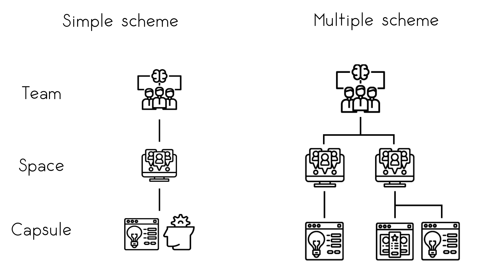

# Teams, Spaces, and Capsules

[Teams](https://codecapsules.io/docs/faq/what-is-a-team), [Spaces](https://codecapsules.io/docs/faq/what-is-a-space), and [Capsules](https://codecapsules.io/docs/faq/what-is-a-capsule) are the foundation of [Code Capsules](https://codecapsules.io). "_Teams contain Spaces and Spaces contain Capsules_".

**Teams** are to organize people. Multiple people can join your Team, and each member of the Team can interact with the Spaces and Capsules that the Team contains. Furthermore, Teams are associated with a payment method – you add a credit card to a Team, and Code Capsules bills this credit card when a charge incurs.

**Spaces** are the second layer of organization. Spaces can contain any amount of Capsules and are excellent tools for larger projects. If your project involves complicated frontend and backend code, splitting your code into multiple Capsules – each within the same space – may help with organization.

**Capsules** provide the actual computational power for running your applications. While Teams and Spaces are organizational tools, Capsules connect to GitHub repositories containing your applications and hosts them on a server. Capsules can run both frontend and backend applications.

For a single, simple project, you would have exactly one team, containing one space, containing one capsule. If you wanted to set up a frontend only project (e.g. a React app) backed by a REST API, you would have two capsules in your space: a frontend Capsule for the React application and a backend Capsule for the REST API.

