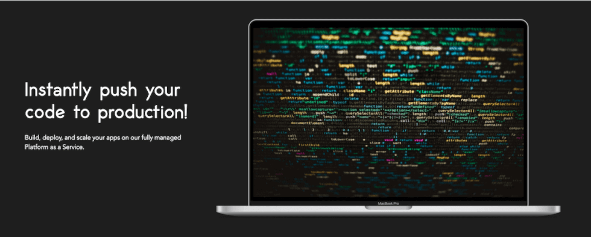
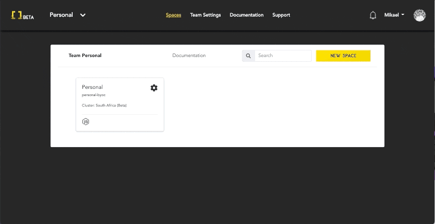
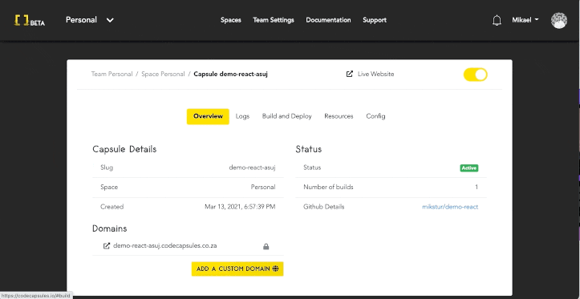
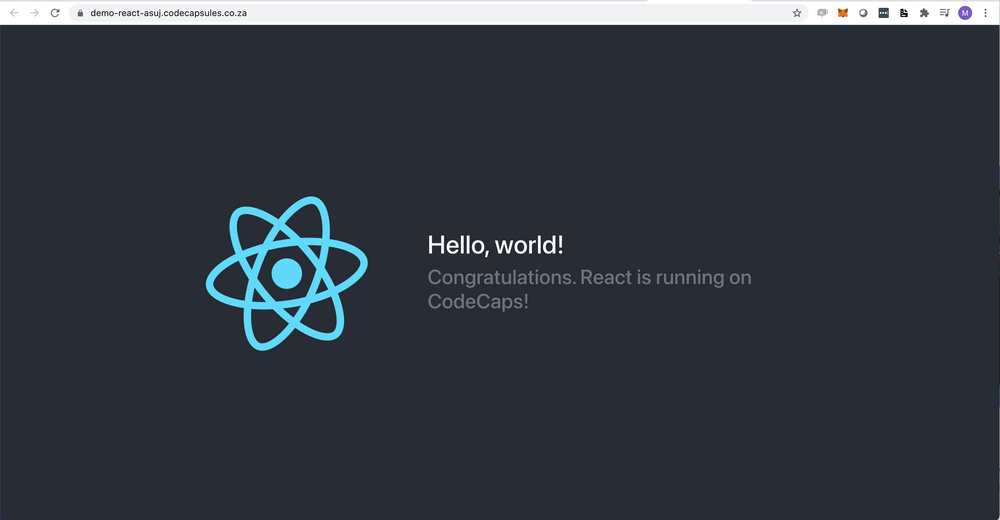
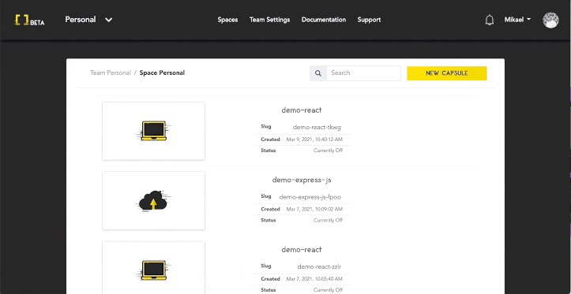
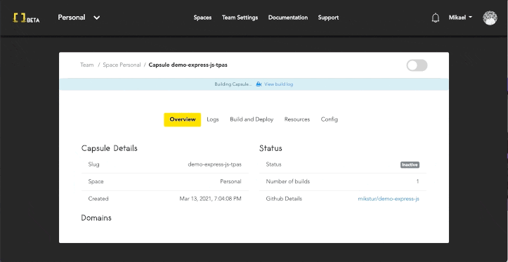
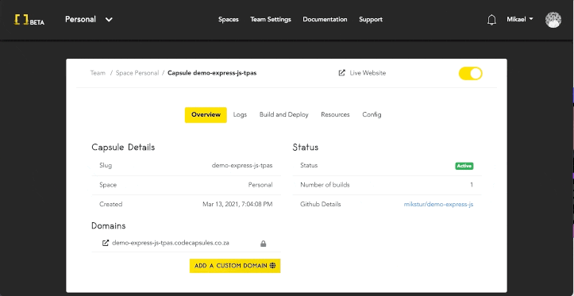
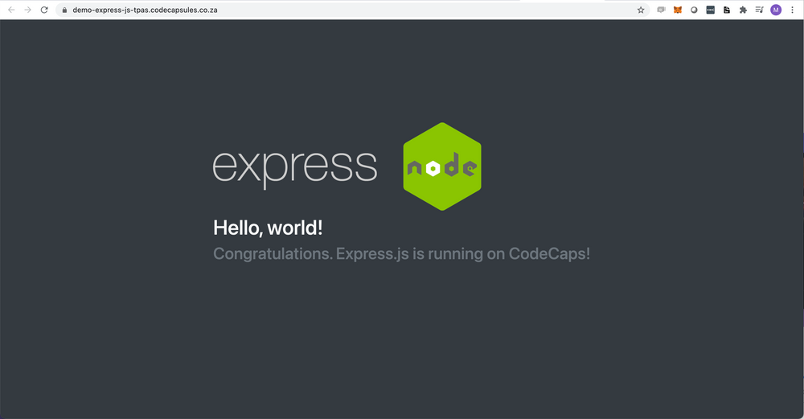
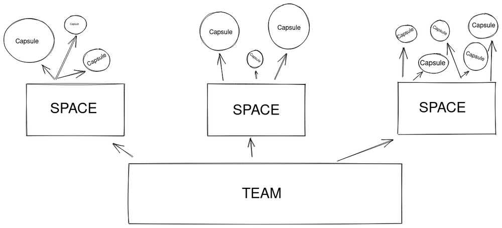

# Introducing Code Capsules

## Background

We have been huge fans of Serverless for many years. The term exists in many forms, such as PaaS (Platform as a Service) or FaaS (Functions as a Service) and every major cloud has some form of Serverless service, which allows us as developers to continuously integrate and deploy our latest code without worrying about infrastructure.

Over the past few years we have enjoyed deploying our backend applications to [Heroku](https://www.heroku.com/) and our static Frontend applications to [Netlify](https://www.netlify.com/). We found the developer experiences to be incredible and many of my projects still easily deploy from a `git push`, even years after initially setting it up.

## Major Problems we faced as Developers

Our company projects at [Appstrax](https://appstrax.tech/) are generally deployed and maintained at a variety of cloud providers, from [AWS](http://aws.amazon.com/) or Heroku to smaller local [to South Africa] shared server environments. This caused a few problems over time for a company like ours.

### Managing Client Infrastructure Billing

We needed to manage the billing for all of our client projects' infrastructure each month. 
We used to collect all of the invoices from the various cloud providers and divide them up to the relevant client and ultimate re-invoice to recover the costs.

This does depend on the client, for us it was mostly non-technical clients that wanted us to manage the infrastructure on their behalf.

It would be great if we could just have those non-technical clients enter their payment methods against the relevant cloud resources and get invoiced directly, saving us some admin time.

### Knowledge Transfer

When a team mate left the company, there was a long and involved process to hand over all the correct project information. 

We needed to make sure we had the right private keys, cloud account logins, documentation and processes to maintain and deploy to the relevant servers. 

A solution was needed going forward whereby the need for exchanging private keys and account logins was avoided to maintain a projects integrity.

### Managing SSL certificates

Managing SSL certificates and private keys were a nightmare depending on the cloud or platform you were using for that project.

We wanted to avoid touching any private keys or server terminals at all and just have every project automate their SSL through something like LetsEncrypt.

### Context Switch

Team mates would often context switch between various cloud providers depending on where the project was located when needing to maintain or fix deployments and infrastructure.

If we had one unified dashboard that every team mate was familiar with, our productivity as a company would be heavily improved.

### Lack of South African PaaS

Local South African servers lack decent developer experience when it comes to anything like CI/CD (Continuous Integration & Deployment) and Heroku and Netlify only targeted US or EU servers.

We thought it would be epic if we could have one platform that would combine all of our favorite PaaS features into one, while solving some of the above problems for us, especially CI/CD to local South African servers. 

We started prototyping [Code Capsules](https://codecapsules.io/) in 2019 through the use of various cloud-native and open source technologies, which has resulted in the application that is now in an Open Beta status.

## Deploying a Static Frontend App

After installing our [Github](https://github.com/) Application into your Code Capsules user account and team, you are able to easily create a [Frontend Capsule](https://codecapsules.io/docs/faq/what-is-a-capsule/) in few simple steps.

1. Select your Github Repository and Branch
2. Choose which folder within your Github Repository contains your static app (Angular, React or Vue)
3. Enter the Build Command, which will tell Code Capsules which command to use to generate your static HTML and JavaScript content
4. Enter the resulting Static Content Folder Path (the result of the build command)

If you enter the Build Command, you will notice that it runs through the Build Logs on the Capsule Details screen:

If you have a plain old HTML and JavaScript app, you may not need a Build Command. You can simply enter the folder path within your Github Repository that contains the `index.html` file, which Code Capsules will serve up once deployed.

## Deploying a Backend App

Similar to the [Frontend Capsule](https://codecapsules.io/docs/faq/what-is-a-capsule/) workflow, a few simple steps is all it takes to get your Backend App online:

1. Select your Github Repository and Branch
2. Choose which folder within your Github Repository contains your static app (Node, Python, Java or .NET Core)
3. Enter the **Run Command**, which will tell Code Capsules which command to use to start your server (ensure your app binds to a `PORT` environment variable)

The [Backend Capsule](https://codecapsules.io/docs/faq/what-is-a-capsule/) will build your code into a container and try to serve up your application. 

It also automatically creates a new build and deploy every time push new code to your Github branch. This can be turned off if you prefer to create builds manually. 

You can view the server logs below:

[Both Frontend and Backend Capsules](https://codecapsules.io/docs/faq/what-is-a-capsule/) will automatically create a free subdomain with an SSL certificate installed. You can choose to [point a custom domain to your capsule](https://codecapsules.io/docs/customising-your-domain-on-code-capsules/) through either a CNAME or A Record from any DNS provider you may be using.

## Team Management

We have broken down the solution to allow developers to [manage their applications and cloud resources](https://codecapsules.io/docs/faq/teams-spaces-and-capsules/) that best meets their needs. 

- You can create as many [Teams](https://codecapsules.io/docs/faq/what-is-a-team/) as you want
- You can create as many [Spaces](https://codecapsules.io/docs/faq/what-is-a-space/) within Teams as you want
- You can invite users into your Team
- You can add different payment methods to different teams, which is helpful if you want to link your clients credit card directly to the Team
- You can view invoices broken down by Team
- You can manage Github Repositories per Team

Check out our [Documentation](https://codecapsules.io/docs/) and [Tutorials](https://codecapsules.io/docs/topic/tutorials/) if you are keen to give it a go. Every Personal Team can enjoy a Free Frontend Capsule to [give our new platform a try](https://codecapsules.io/). 

We would love to hear any and all feedback (join us on our [Slack Team](https://codecapsules.io/slack)) so that we can improve our solution and hopefully add value to other developers 🚀.