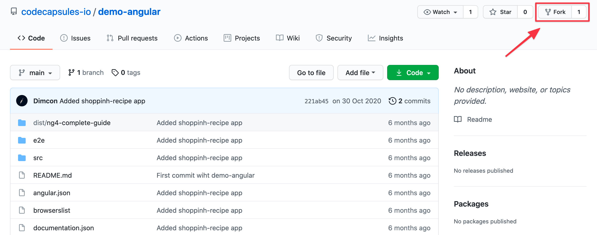
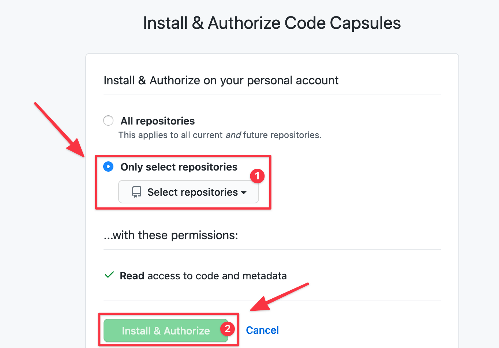

# How to Deploy an Angular Application to Production on Code Capsules

Deploy an Angular application and learn how to host frontend code on Code Capsules. 

## Set Up

Code Capsules connects to GitHub repositories to deploy applications. For this tutorial, you'll need:
- A [Code Capsules](https://codecapsules.io/) account. 
- A [GitHub](https://github.com/) account.  

To demonstrate how to deploy an Angular application with Code Capsules, we'll use our [example application](https://github.com/codecapsules-io/demo-angular). 

Follow the link above and fork the application by clicking "fork" at the top-right of the repository. With the Angular application forked to your GitHub account, we are ready to deploy it on Code Capsules.

## Sign Up for Code Capsules

If you don't already have a [Code Capsules](https://codecapsules.io/) account, head to the site and click the "Sign Up" button in the top right. Enter your details to create an account, or log into an existing one.

If you've just signed up for an account, you'll be directed to the _Welcome_ page on your first login. Click on the "Go To Personal Team" button.

After clicking on the "Go To Personal Team" button, you will be redirected to the _Spaces_ tab for your Personal Team. A [Team](https://codecapsules.io/docs/faq/what-is-a-team/) is an environment for you to manage your Spaces and Capsules. Teams can have multiple members interacting with the projects associated with that particular Team. Code Capsules gives every account a Personal Team as the default.

## Create a Space for Your Apps

[Spaces](https://codecapsules.io/docs/faq/what-is-a-space) are an organisational tool for your applications. Click the "Create A New Space For Your Apps" button and follow the prompts, naming the Space anything you'd like.

Now that we've created a Space, we need to connect the GitHub repository we forked to our Code Capsules.

## Link to GitHub

To host our application on Code Capsules, we need to link our forked GitHub repository to our Code Capsules account.

We can link the GitHub repository by clicking the profile image at the top right of the screen, and finding the "GitHub" button under "GitHub Details".

 

Click the "GitHub" button. To give Code Capsules access to the Angular application:

1. Click your GitHub username.
2. Select "Only Select Repositories".
3. Choose the GitHub repository we forked.
4. Press "Install & Authorize".

After authorising, Code Capsules will be able to read the contents of the selected repositories. All that's left to deploy the application is to add the repo to your Team and create a [Capsule](https://codecapsules.io/docs/faq/what-is-a-capsule). Capsules act as storage space for the different types of applications you'd host on Code Capsules.

## Add Repo to Team

Click on "Team Settings" on the top navigation bar to switch to the _Team Settings_ tab. Once there, click on the "Modify" button under the _Team Repos_ section to add the repo to your Personal Team. When the "Edit Team Repos" screen slides in, select "Add" next to the repo you want to add to your Personal Team and then confirm. After this is done, all Spaces in your Team will have access to this repo. 

## Create and Build the Capsule

It's time to create a [Capsule](https://codecapsules.io/docs/faq/what-is-a-capsule). To do this, navigate to the _Spaces_ tab and open the Space you created for this tutorial. Once inside the Space, click the "New Capsule" or "Create A New Capsule For Your Space" button and follow the instructions below.

1. Choose a "Frontend" Capsule.
2. Select the "Trial - Static Site Hosting" product.
3. Choose the GitHub repository we forked.
4. Press next.
5. Use `npm run build` for the "Build command" and `dist` for "Static content folder path".
6. Press "Create Capsule".

You can view the build logs under the _Build and Deploy_ tab in your Capsule. When the Capsule builds, navigate to the _Overview_ tab and click on the provided URL to view the application. 

For a better understanding of Capsules, [read this explanation on Capsules](https://codecapsules.io/docs/faq/what-is-a-capsule/).

If you want to deploy another Angular application in the future, it'll be useful to check out the script Code Capsules used to build the Angular application. [Navigate to the Angular repository](https://github.com/codecapsules-io/demo-angular/) we forked and take a look at the `package.json` file. On line four, you'll see the script Code Capsules used to deploy the application. 
