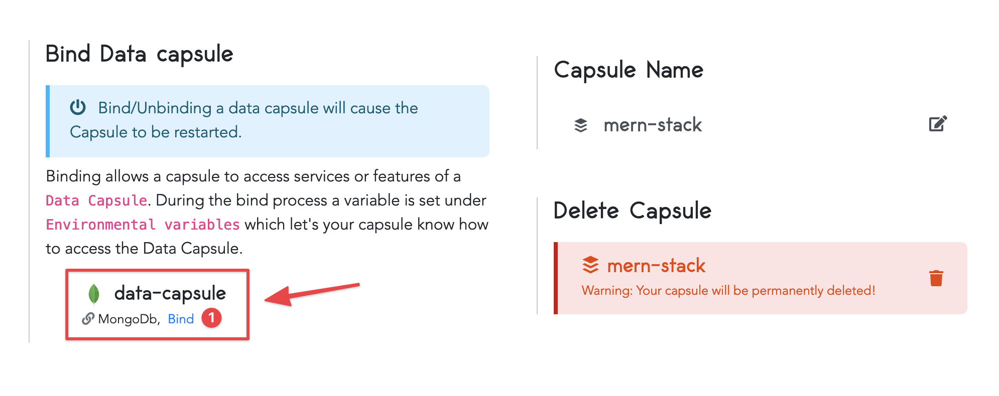
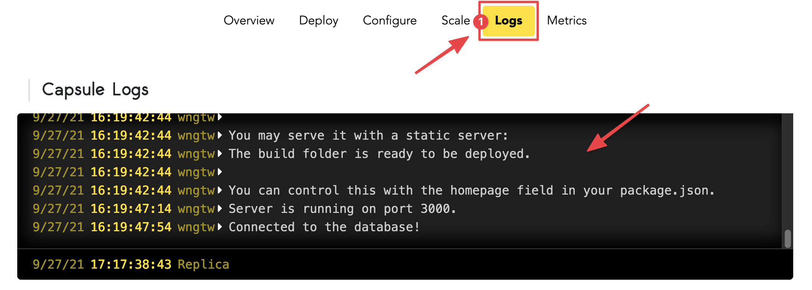

# How to Deploy a MERN Stack Application to Production on Code Capsules

Deploy a MERN (MongoDB, Express, React, Node) stack application using a backend and data capsule for a full stack application without the need for a frontend capsule. 

## Getting Started

This guide is a walkthrough on how to deploy a MERN stack application that accepts a name as input and displays a personalized message for the user. The example application we will use can be found on [Code Capsules' GitHub](https://github.com/codecapsules-io/mern-stack) account.

Fork the project in the above mentioned repository to your own GitHub account and link the repository with your Code Capsules account. You can do this by clicking your username at the top right in Code Capsules, and choosing Edit Profile. Now you can click the GitHub button to link to the repo. 

## Setting Up the Capsules

Create a Space which will house the backend and data capsules needed to successfully deploy the application. Once the Space is there, create the two capsules as shown below.

First the data capsule.

Followed by the backend capsule.  

Select the repository you forked earlier and in the "Run Command" field enter `node index.js` to let the capsule know how to run your application.

## Binding the Capsules

After successfully building the capsules the next step is to bind them together. Navigate to the backend capsule you just created and open the "Configure" tab. Scroll to "Bind Data Capsule" section and click on the "Bind" option in the bottom left to allow the capsule to use the MongoDB database in the data capsule. 

## View Application

The application will be ready for use after binding the two capsules together. To view it, click on the "Live Website" link at the top of your backend capsule page.

## View Application Logs

You can also view your application's logs by navigating to the "Logs" tab on your backend capsule page.

