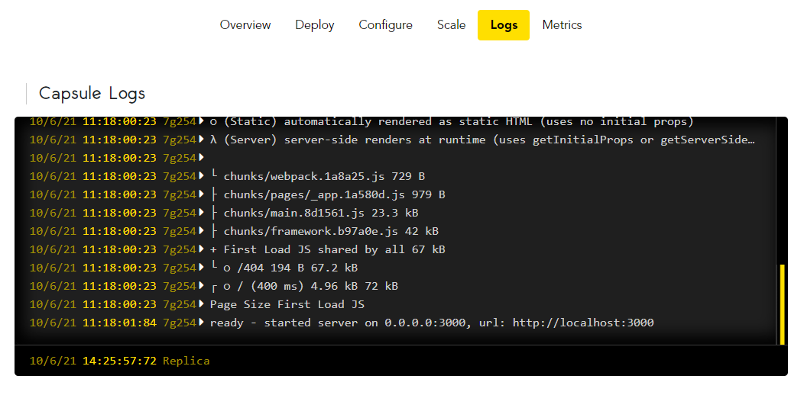

# How to Deploy a Next Application to Production on Code Capsules

Deploy a Next application using a Backend Capsule for the server side rendered React.

## Getting Started

In this guide, we will take a look at how to deploy a Next application to Code Capsules using a [demo-next application]() that can be found on Code Capsules GitHub account. The example application is a bare minimum implementation of Next and can be extended to add useful features.  

Fork the repository mentioned above to your own GitHub account to get the example code.

## Linking to GitHub

When you've created a fork of the repository the next step will be to link it to your Code Capsules account. To do this, click your profile image at the top right of your screen in Code Capsules. 

On the "Profile" tab click the "GitHub" button to start the process of linking to the repo. 

You now need to authorise Code Capsules to connect to the Next application repository by:

1. Clicking your GitHub username.
2. Selecting "Only Select Repositories".
3. Choosing the GitHub repository we forked.
4. Pressing "Install & Authorize".

Pressing the "Install & Authorize" button will give Code Capsules permission to read the Next application repository data. 

## Add Repo to Team

We need to add the Next repository to our "Personal Team" so that all Capsules created under that Team can read its data. Navigate to the "Team Settings" tab on the top navigation bar.

Once there, click on the "Modify" button under the _Team Repos_ section to add the repo to your Personal Team. When the "Edit Team Repos" screen slides in, select "Add" next to the repo you want to add to your Personal Team and then confirm. 

## Create a Space for Your App

The next step is to create a Space that will house the Backend Capsule which will host the Next application we'll deploy shortly. To do this, navigate to the "Spaces" tab and click on the "Create A New Space For Your Apps" button.

After actioning this step, a screen similar to the one shown below should slide in from the right.

Select an appropriate region and enter a name for your space and press "Create Space".

## Create the Capsule

Create a Backend Capsule by clicking on the "Create a New Capsule for Your Space" button from inside your Space.

Choose a Backend Capsule on the screen that follows, then:

1. Select the "Sandbox" product.
2. Choose the GitHub repository we forked.
3. Press next.
4. Leave the "Run Command" blank and create the Capsule.

You can view the [logs](#view-logs) while the capsule is building your application to track its progress, as it might take a while. For a better understanding of Capsules, take a look at [this explanation](https://codecapsules.io/docs/FAQ/what-is-a-capsule).

## View Logs

While the Capsule is building, you can view its logs by navigating to the "Logs" tab on your Backend Capsule page.  

## View Application

You will be able to view your application after the build is finished. To do so, navigate to the "Overview" tab and click on the "Live Website" link.

