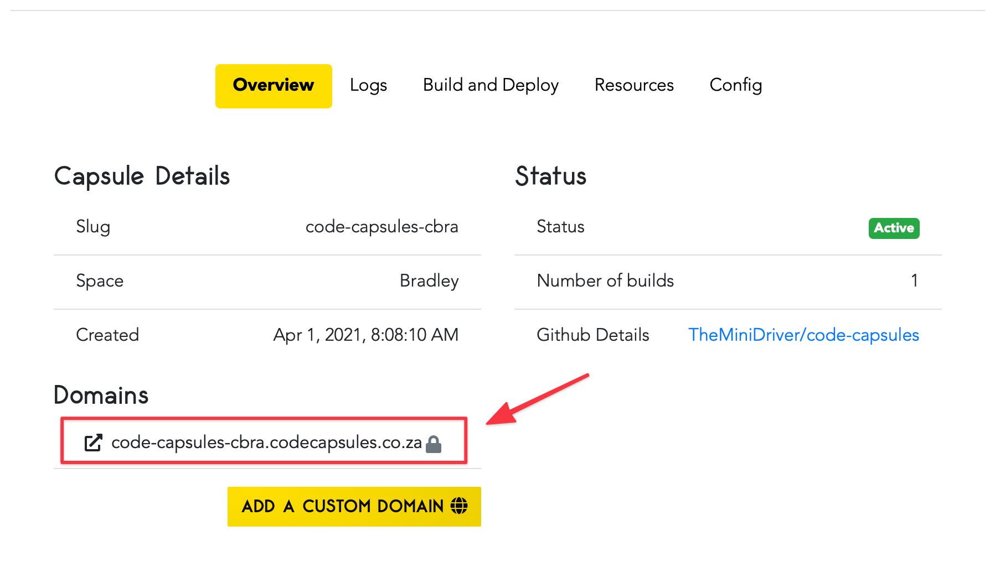
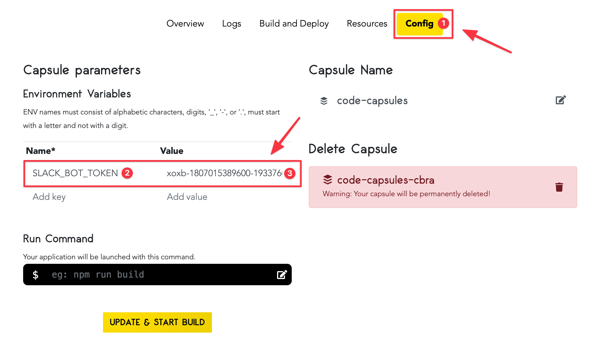
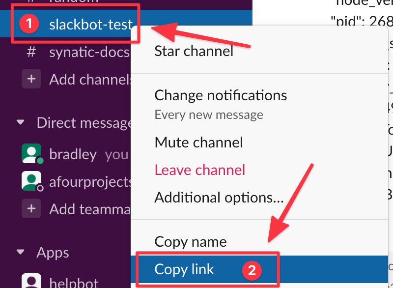

# How to Deploy a Node.js Slack Bot to Production on Code Capsules

Deploy a Node.js Slack Bot and learn how to host backend code on Code Capsules.

## Set up

Code Capsules connects to GitHub repositories to deploy applications. To follow this guide, you’ll need a [Code Capsules](https://codecapsules.io/) account and a [GitHub](https://github.com/) account.

To demonstrate how to deploy a Node.js Slack Bot with Code Capsules, we’ve provided an example bot which you can find on the [Code Capsules GitHub repository](https://github.com/codecapsules-io/slackbot).

Sign in to GitHub, and fork the example bot repository by clicking "Fork" at the top-right of your screen and selecting your GitHub account as the destination.

## Create a Space for your Bot

Log in to your Code Capsules account and navigate to the "Spaces" tab. Once there, click the "Create A New Space For Your Apps" button. 

Follow the prompts, choosing your region and giving your Space a name, then click "Create Space".

## Link to GitHub

To link to GitHub, click your profile image at the top right of the Code Capsules screen and find the "GitHub" button under "GitHub Details".

Click the "GitHub" button, select your GitHub username, and do the following in the dialog box that appears:

1. Select "Only Select Repositories".
2. Choose the GitHub repository we forked.
3. Press "Install & Authorize".

## Add Repository to Team

Select "Team Settings" in the top navigation bar to switch to the Team Settings tab.

Click on the "Modify" button under the "Team Repos" section. An "Edit Team Repos" screen will slide in from the right. Click "Add" next to the bot repo, and then "Confirm". All the Spaces in your Team will now have access to this repo.

## Create the Capsule

A [Capsule](https://codecapsules.io/docs/FAQ/what-is-a-capsule/) provides the server for hosting an application on Code Capsules.

Navigate to the "Spaces" tab and open the Space you’ll be using.

Click the "Create a New Capsule for Your Space" button, and follow the instructions below:

1. Choose "Backend Capsule".
2. Under "Product", select "Sandbox".
3. Choose the GitHub repository you forked.
4. Press "Next".
5. Leave "Run Command" blank.
6. Click "Create Capsule".

Code Capsules will automatically build your application when you’ve finished creating the Capsule. While the build is in progress, you can view the log by clicking "View Build Progress" next to the "Building Capsule" message.

Once your application is live, you can view the build log by selecting the "Deploy" tab and clicking the "View build log" link in the "Builds" section.

## Register the Bot

You'll need a Slack user account and to log into a workspace before you can create a Slack bot. After you have logged into a workspace head over to the [Slack API](https://api.slack.com/) page and click on "Create an app".

1. On the popup that displays, choose the "From scratch" option, give your app a name and choose the workspace you want to add it to then click "Create App".
2. Click "OAuth & Permissions" on the left panel and scroll down to the *Scopes* section and click "Add an OAuth Scope" under the *Bot Token Scopes* section.

3. Choose "chat:write" from the options list.
4. Click on the "Slash Commands" menu item on the left, under Features then click "Create a new Command".

5. Give the command the name `/stats`.
6. For the Request URL, head over to your Capsule Overview page on Code Capsules and copy the Domain name under the *Domains* section.

7. Paste your domain into the Request URL box on Slack, and add `/slack/command/stats` to the end of it.
8. Fill in the description with 'Returns key stats from the app'.

9. Click "Save". 

## Add Environment Variables

Our bot's logic makes use of environment variables to function securely. You'll need to add the variables to your capsule's "Configure" tab before the bot can send/receive messages from your workspace. 

For the first environment variable, `SLACK_BOT_TOKEN`: 

1. Head over to your app dashboard on Slack, and click on the "OAuth & Permissions" menu item on the left-hand side. 
2. Click the "Install to Workspace" button followed by the "Allow" button. 
3. Actioning the preceeding 2 steps should reveal a newly generated "Bot User OAuth Token". Copy this token. 
4. On your capsule's "Configure" tab, add a new environment variable with the name `SLACK_BOT_TOKEN` and set its value to the token you copied in the previous step. 

5. Click the "Update Capsule" button to save your changes.

For the second environment variable, `SLACK_CHANNEL_ID`:

1. Open Slack and right-click on the channel name of the channel you want to send messages to.
2. On the context menu that appears, choose "Copy Link".

3. Paste the link in a browser tab but don't press "enter" or "return".
4. The link should follow the format, `https://<workspace-name>.slack.com/archives/C01SZ6Z3TCY`. The last part of that URL is the channel ID; in this example case, `C01SZ6Z3TCY`.
5. Add the channel ID to the environment variables with the name `SLACK_CHANNEL_ID`.

6. Click the "Update Capsule" button to save your changes.

For the third environment variable, `SLACK_SIGNING_SECRET`:

1. Head over to your Slack app dashboard and click on "Basic Information" on the left-hand side.
2. Scroll down to *App Credentials* and look for the *Signing Secret*. Click "Show" and copy the secret.

3. Add a new environment variable with the name `SLACK_SIGNING_SECRET` on your capsule's "Configure" tab and set its value to the secret you copied in the previous step.

4. Click the "Update Capsule" button to save your changes.

## Invite Bot to Channel

You need to invite the bot to the chosen channel so that it'll be able to post there. To do this, send a message mentioning `@<bot-name>` the bot in the channel you added it to. Click "Invite Them" when Slack prompts you.

## Chat with the Bot 

The bot can now send messages to the channel everytime it starts. You can restart the capsule to see this functionality in action or alternatively send a `/stats` message in the channel to get a report about the bot's status on Code Capsules.

If you’d like to deploy another application in a different language or framework, take a look at our other [deployment guides](/docs/deployment/).