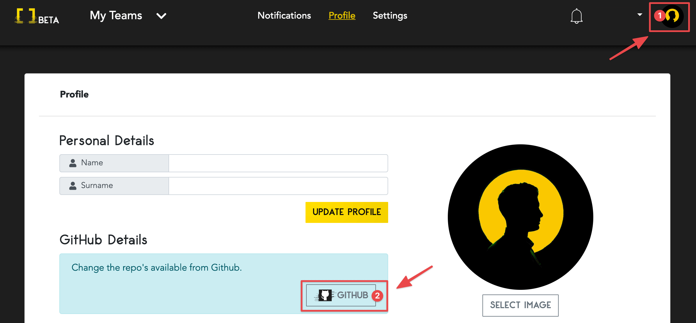
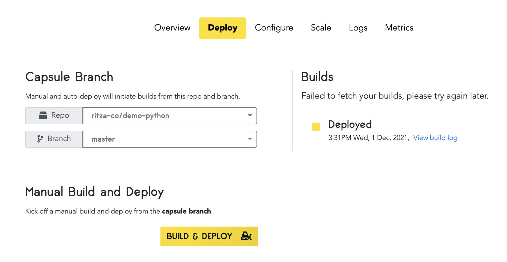
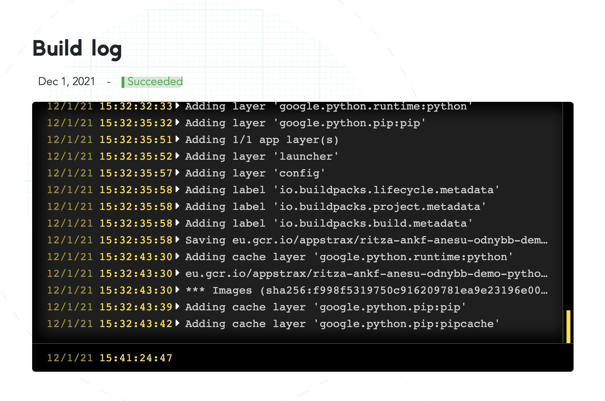
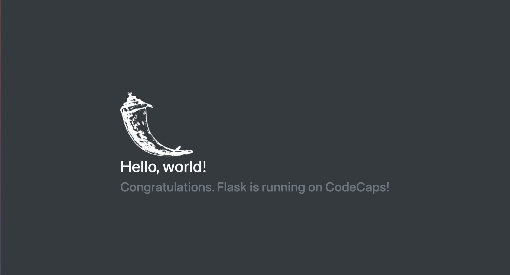

# Python Development with Code Capsules

In this guide, we'll clone an existing Python repository and take a look at how to edit the project locally before pushing the changes to GitHub. The final step will be to deploy the application with the changes we made locally to Code Capsules. 

## Clone Starter Project

We'll be using an example starter project provided by Code Capsules on their [GitHub repository](https://github.com/codecapsules-io/demo-python). Fork this repository by clicking "Fork" at the top-right of your screen and selecting your GitHub account as the destination. Clone the forked repository to your machine by clicking the green "Code" button and copying the link that appears in the pop-up. 

Open a terminal window on your machine and navigate to your preferred working directory. Run `git clone <FORKED-REPO-URL>`, replacing `<FORKED-REPO-URL>` with the link you copied from the pop-up above. 

## Run Starter Project Locally

Before we can run the project locally, we need to create and activate a virtual environment where we'll install the project's dependencies. Depending on your machine, run the appropriate commands from the ones listed below:

MacOS
```
python3 -m venv env
source env/bin/activate
```

Windows
```
py -m venv env
.\env\Scripts\activate
```

Next, install the project's dependencies by running `pip install -r requirements.txt` in the same terminal window your environment is activated in.

To start the application, run the command `python3 -m flask run` in the same terminal window and you should see the application in your browser.

## Make Changes

Open the `app/routes.py` file in your text editor and add the code snippet below to add another route to the app:

```py
@app.route('/greeting')
def greeting():
    return "Hello there, thank you for visiting my new route"
```

You need to stop and restart the server in order to see your changes.

## Push the Changes

Add and commit the changes you made by running the commands below in a terminal window while in the project's root folder:

```
git add app/routes.py
git commit -m "Added new route"
```

Push the changes to your remote repository by running `git push` in the same terminal window.

## Link to GitHub

To link Code Capsules to your remote GitHub repository, log in to your Code Capsules account and click your profile image at the top right of the screen. Find the "GitHub" button under "GitHub Details".



Click the "GitHub" button, select your GitHub username, and do the following in the dialog box that appears:

1. Select "Only Select Repositories".
2. Choose the GitHub repository you recently pushed to.
3. Press "Install & Authorize".


## Add Repository to Team

Select "Team Settings" in the top navigation bar to switch to the "Team Settings" tab.

Click on the "Modify" button under the Team Repos section. An "Edit Team Repos" screen will slide in from the right. Click "Add" next to the demo repo, and then "Confirm". All the Spaces in your Team will now have access to this repo.


## Create a Space for your App

[Spaces](https://codecapsules.io/docs/FAQ/what-is-a-space/) are an organizational tool for your applications. You can select the Personal Space that you find in your default Personal Team to host this app, or you can create a new Space. In the "Spaces" Tab, click the "Create A New Space For Your Apps" button. 

Follow the prompts, choosing your region and giving your Space a name, then click "Create Space".


## Create the Capsule

A [Capsule](https://codecapsules.io/docs/FAQ/what-is-a-capsule/) provides the server for hosting an application on Code Capsules.

Navigate to the "Spaces" tab and open the Space you’ll be using.

Click the "Create a New Capsule for Your Space" button, and follow the instructions below:

1. Choose "Backend Capsule".
2. Under "Product", select "Sandbox".
3. Choose your remote GitHub repository.
4. Press "Next".
5. Leave "Run Command" blank.
6. Click "Create Capsule".

Code Capsules will automatically build your application when you’ve finished creating the Capsule. While the build is in progress, you can view the log by clicking "View Build Progress" next to the "Building Capsule" message.



Once your application is live, you can view the build log by selecting the "Deploy" tab and clicking the "View build log" link in the "Builds" section.



Once the build is complete, a "Live Website" link will appear at the top of the tab. Click the link and you should see your deployed application.



If you’d like to deploy another application in a different language or framework, take a look at our other [deployment guides](/docs/deployment/).
