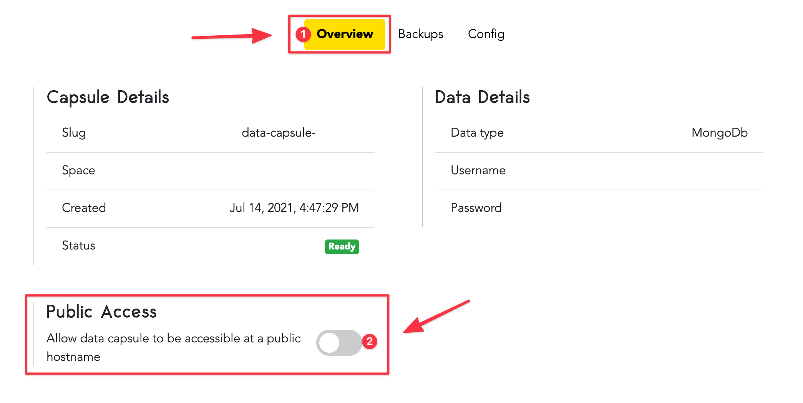
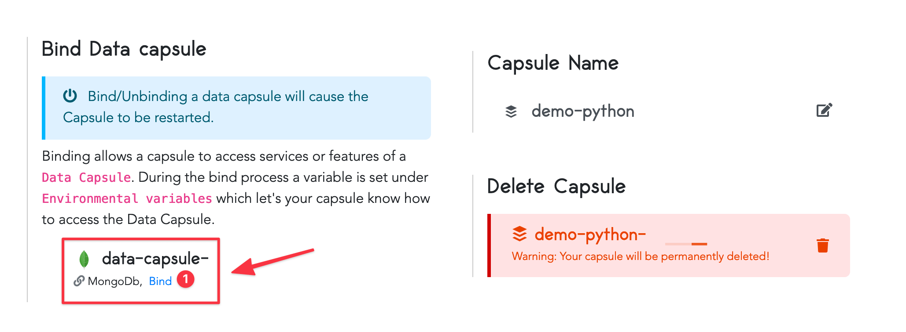
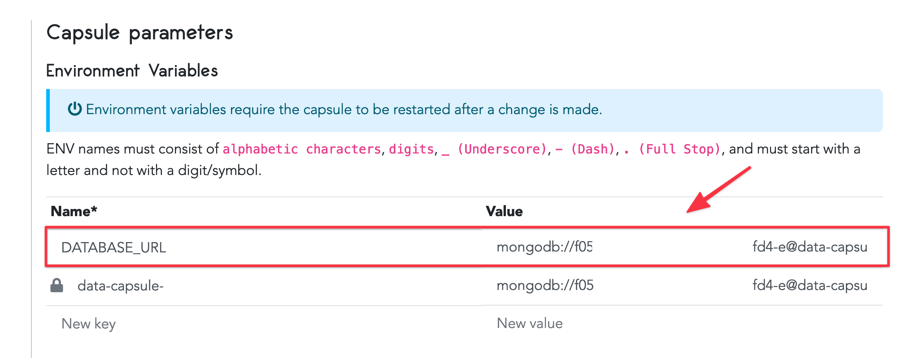
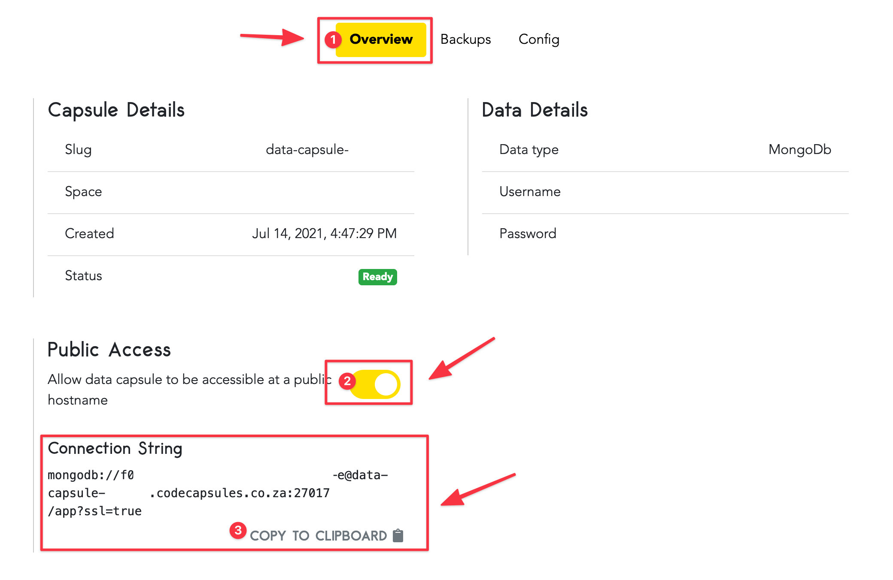

# How to Set Up a MongoDB Data Capsule

## Create a MongoDB Data Capsule

Log in to your Code Capsules account and navigate to the Space your MongoDB data capsule will be contained in. Click "New Capsule" and select the "Data Capsule" option from the Create New Capsule dialog that slides in from the right. 


In the New Data Capsule dialog, choose "MongoDB Database Cluster" as your data type, then click the "Create Capsule" button. 


To allow your data capsule to be publicly accessible, navigate to the "Overview" tab of the capsule details screen and toggle the switch under "Public Access" to on. 



Select this option if you plan on connecting your data capsule to an application that's not hosted on Code Capsules.  

## Binding a Data Capsule to a Backend Capsule

Data capsules need to be connected to a backend capsule or application before you can use them. If you're hosting your backend application on Code Capsules, navigate to the capsule of the backend application and click "Config" to open the capsule's config tab. Scroll down to the "Bind Data capsule" section where your recently created data capsule will show.



Click "Bind" to bind your data and backend capsules. During the bind process, Code Capsules creates a `DATABASE_URL` environmental variable to let your backend capsule know how to access services and features of your data capsule. Once the two capsules have been bound, you can scroll to the top of the Config tab to find the value of this variable. 



We can use this database variable in code to read and write to our data capsule. Copy the value of the `DATABASE_URL` variable and append `/your_db_name?authSource=admin` to it as a query parameter. This tells the data capsule to read and write to the specified database. If a database named `your_db_name` doesn't exist, the data capsule will create it. This allows you to have multiple databases in one data capsule.

### Connecting to a MongoDB Data Capsule From a Python Application 

If your backend capsule is a Python application, use the following code to connect to your MongoDB Data Capsule:

```python
import os
import pymongo

data_capsule_url = os.getenv('DATABASE_URL')
database_one_url = data_capsule_url + "/database_one?authSource=admin"
production_database_url = data_capsule_url + "/production_database?authSource=admin"

client = pymongo.MongoClient(database_one_url)
db = client.database_one

### Do something with the db variable here

```

### Connecting to a MongoDB Data Capsule From a Node.js Application 

If your backend capsule is a Node.js application, use the following code to connect to your MongoDB Data Capsule:

```js

data_capsule_url = process.env.DATABASE_URL
database_one_url = data_capsule_url + "/database_one?authSource=admin"
production_database_url = data_capsule_url + "/production_database?authSource=admin"

var MongoClient = require('mongodb').MongoClient;

MongoClient.connect(database_one_url, function(err, db) {

    // Do something with the db variable here
});

```

## Connecting to a MongoDB Data Capsule From Outside Code Capsules

If you're not hosting your backend application on Code Capsules you can still connect your data capsule to it. The first step is to allow public access to your data capsule. Make sure this option is turned on in the "Overview" tab of your data capsule's details screen.



If public access to your data capsule is enabled, a connection string is visible below the "Public Access" switch, as shown in the above picture. Copy this connection string and paste it into your backend application's code to access your data capsule's services. Take note if you copy the connection string from the capsule it will already include the database name eg. in the screenshot above this part of the connection string `/app?ssl=true` includes the database name which is `app` in this case. 

### Connecting to a MongoDB Data Capsule From an Externally Hosted Python Application 

If your backend application is written in Python, use the following code to connect to your MongoDB Data Capsule: 

```python
import pymongo

database_url = "<connection_string_here>" + "/database_one?authSource=admin&ssl=true"

client = pymongo.MongoClient(database_url)
db = client.database_one

### Do something with the db variable here

```

You'll notice in the code that we appended `/database_one?authSource=admin` to the connection string. This tells the data capsule to create a database with the name `database_one` if it doesn't exist, or to connect to it if it does. 
