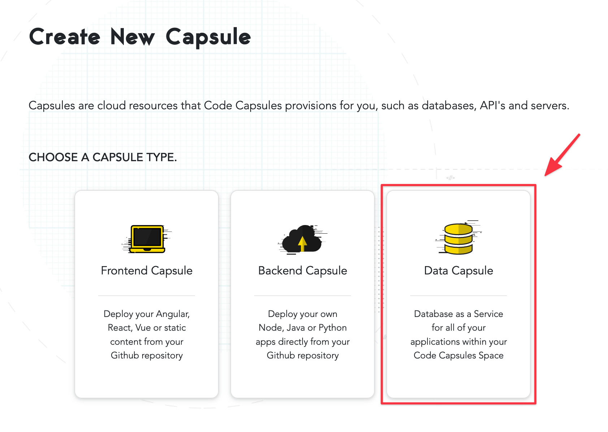
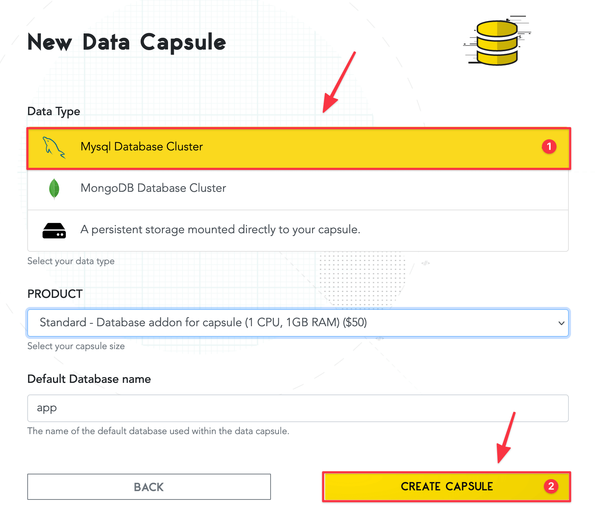
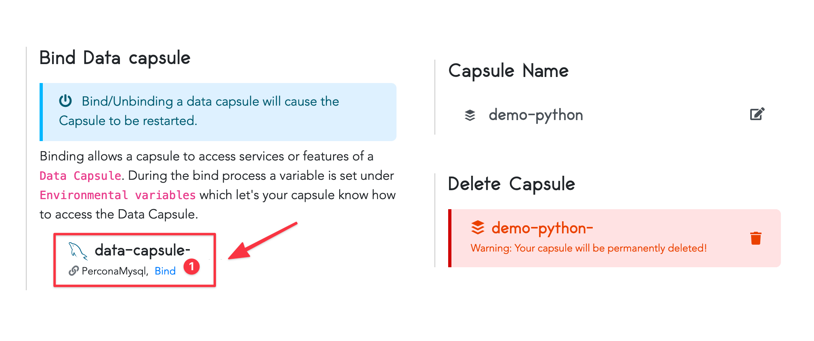
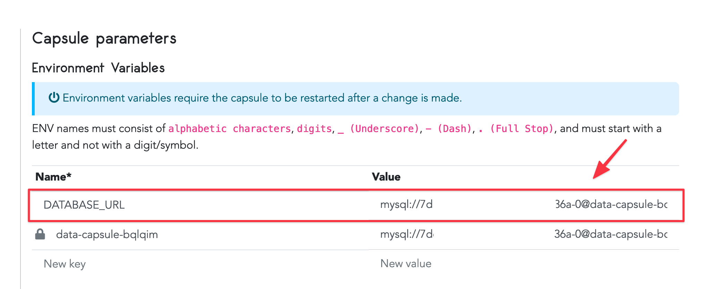

# How to Set Up a MySQL Data Capsule

In this tutorial, we'll create a MySQL Data Capsule to provide persistent storage for your applications hosted on Code Capsules.

## Create a MySQL Data Capsule

Log in to your [Code Capsules](https://codecapsules.io) account and navigate to the Space your MySQL Data Capsule will be contained in. Click "New Capsule" and select the "Data Capsule" option from the Create New Capsule dialog that slides in from the right. 



In the New Data Capsule dialog, choose "Mysql Database Cluster" as your data type, then click the "Create Capsule" button. 

  

## Binding a Data Capsule to a Backend Capsule

To use the Data Capsule with your Backend Capsule, you'll need to link the two. Navigate to the Backend Capsule and click "Configure" to open the Capsule's configuration tab. Scroll down to the "Bind Data capsule" section and you'll see your recently created data capsule.



Click "Bind" to bind your Data and Backend Capsules. During the bind process, Code Capsules creates a `DATABASE_URL` environmental variable to let your Backend Capsule know how to access your Data Capsule's services and features. Once the two capsules have been bound, you can scroll to the top of the "Configure" tab to find the value of this variable under the "Capsule parameters" section. 



We can use this database variable in code to read and write to our Data Capsule. Copy the value of the `DATABASE_URL` variable and append `/your_db_name` to it as a query parameter. Make sure to replace `your_db_name` with the actual name of your database. This tells the Data Capsule to read and write to the specified database. If a database named `your_db_name` doesn't exist, the Data Capsule will create it. This allows you to have multiple databases in one Data Capsule. Take note if you copy the `DATABASE_URL` value from the capsule it will already include the name of the default database you used whilst creating the data capsule as part of the string.

### Connecting to a MySQL Data Capsule from a Python Application 

If your Backend Capsule is a Python application, use the following code to connect to your MySQL Data Capsule:

```python
import os
import mysql.connector

data_capsule_url = os.getenv('DATABASE_URL')
employees_database_url = data_capsule_url + "/employees"

cnx = mysql.connector.connect(user='yourusername', password='yourpassword',
                              host=employees_database_url,
                              database='employees')

### Do something with the cnx variable here

cnx.close()

```

### Connecting to a MySQL Data Capsule from a Node.js Application 

If your Backend Capsule is a Node.js application, use the following code to connect to your MySQL Data Capsule:

```js
var mysql = require('mysql');
var data_capsule_url = process.env.DATABASE_URL
var employees_database_url = data_capsule_url + "/employees"

var con = mysql.createConnection({
  host: employees_database_url,
  user: "yourusername",
  password: "yourpassword"
});

con.connect(function(err) {
  if (err) throw err;
  console.log("Connected!");
  // Do something with the db here
});

```
