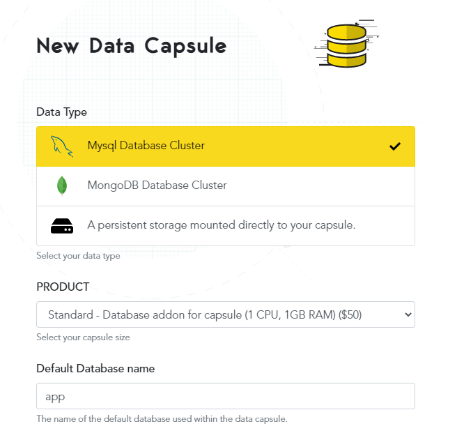
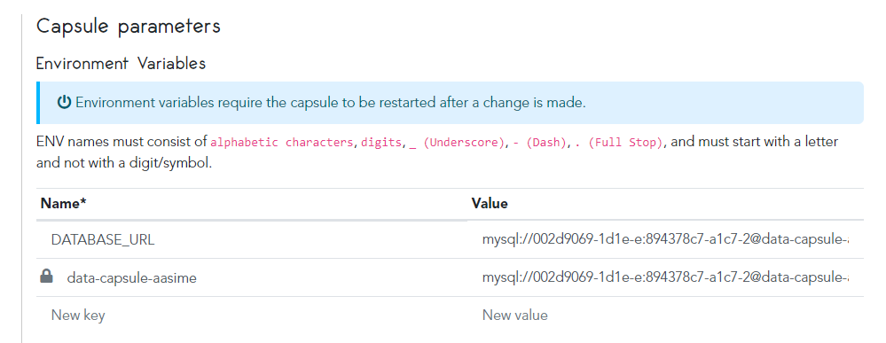

# How to Set Up a MySQL Data Capsule

Data capsules make it possible for your applications to have persistent storage. MySQL is one of the most popular database management systems available and in this tutorial we will look at how to create a MySQL data capsule and use it with applications hosted on Code Capsules.

## Create a MySQL Data Capsule

Log in to your Code Capsules account and navigate to the Space your MySQL data capsule will be contained in. Click "New Capsule" and select the "Data Capsule" option from the Create New Capsule dialog that slides in from the right. 


In the New Data Capsule dialog, choose "Mysql Database Cluster" as your data type, then click the "Create Capsule" button. 

  

## Binding a Data Capsule to a Backend Capsule

To connect a data capsule to a backend capsule hosted on Code Capsules you need to bind the two together before you can connect to and use your data capsule. 

Navigate to the backend capsule and click "Config" to open the capsule's config tab. Scroll down to the "Bind Data capsule" section where your recently created data capsule will show.


Click "Bind" to bind your data and backend capsules. During the bind process, Code Capsules creates a `DATABASE_URL` environmental variable to let your backend capsule know how to access services and features of your data capsule. Once the two capsules have been bound, you can scroll to the top of the Config tab to find the value of this variable. 



We can use this database variable in code to read and write to our data capsule. Copy the value of the `DATABASE_URL` variable and append `/your_db_name` to it as a query parameter. Make sure to replace `your_db_name` with the actual name of your database. This tells the data capsule to read and write to the specified database. If a database named `your_db_name` doesn't exist, the data capsule will create it. This allows you to have multiple databases in one data capsule.

### Connecting to a MySQL Data Capsule From a Python Application 

If your backend capsule is a Python application, use the following code to connect to your MySQL Data Capsule:

```python
import os
import mysql.connector

data_capsule_url = os.getenv('DATABASE_URL')
employees_database_url = data_capsule_url + "/employees"

cnx = mysql.connector.connect(user='scott', password='password',
                              host=employees_database_url,
                              database='employees')

### Do something with the cnx variable here

cnx.close()

```

### Connecting to a MySQL Data Capsule From a Node.js Application 

If your backend capsule is a Node.js application, use the following code to connect to your MySQL Data Capsule:

```js
var mysql = require('mysql');
var data_capsule_url = process.env.DATABASE_URL
var employees_database_url = data_capsule_url + "/employees"

var con = mysql.createConnection({
  host: employees_database_url,
  user: "yourusername",
  password: "yourpassword"
});

con.connect(function(err) {
  if (err) throw err;
  console.log("Connected!");
  // Do something with the db here
});

```