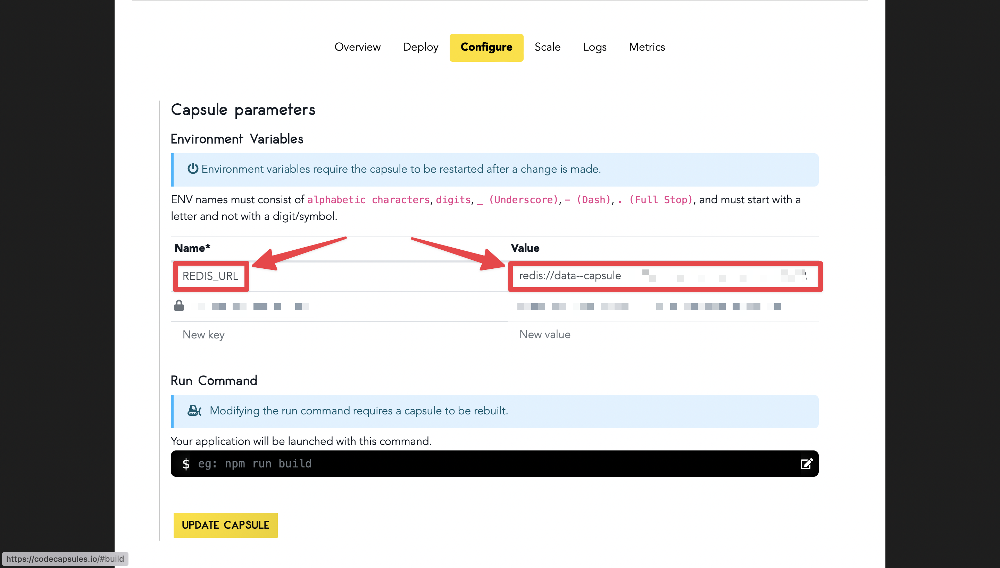

# How to setup a Redis Data Capsule

In this tutorial, we’ll create a Redis Data Capsule to provide low latency, in-memory data storage to our applications hosted on Code Capsules.

## Create a Redis data capsule

Login in to your Code Capsules account and enter the Space you wish to create your Redis Capsule within, then select “New Capsule". From there create a new Data Capsule:


Select Redis from the list of data types and click "Create Capsule".


Now we need to bind our Data Capsule to a Backend Capsule. Navigate to a Backend Capsule and  and click the "Configure" option on the menu. Scroll down to the “Bind Data Capsule” section and click “Bind”.


During the “Bind” process, Code Capsules creates a `REDIS_URL` environment variable which will let your application connect to your Redis database. Once the Capsules have been bound you can find the variable under "Config" in the menu, in the Capsule parameters section.



We will use this environment variable in our app to connect to the database in the next step.


## Connecting to a Redis Data Capsule from a Python Application

If your Backend Capsule is a Python application, use the following code to connect to your Redis database:

```python
import os
import redis

redis_url = os.getenv('REDIS_URL')

r = redis.from_url(redis_url)

# Do something here
```

## Connecting a database from a node.js application
If your Backend Capsule is a Node.js application, use the following code to connect to your Redis database:

```js
var redis = require(‘redis’)
var data_capsule_url = process.env.DATABASE_URL

const client = redis.createClient({
  url: data_capsule_url
})

await client.connect()

// Do something here

client.quit()
```
