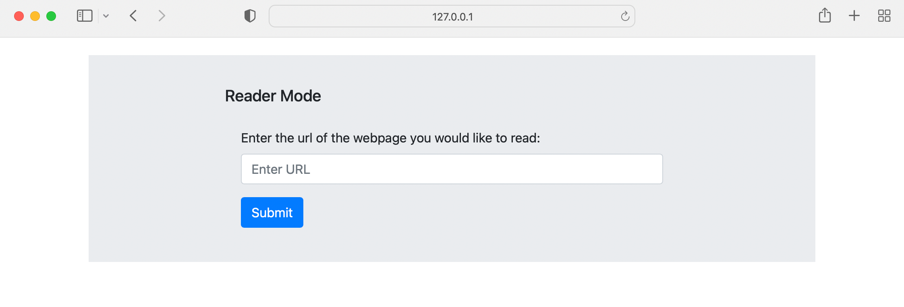
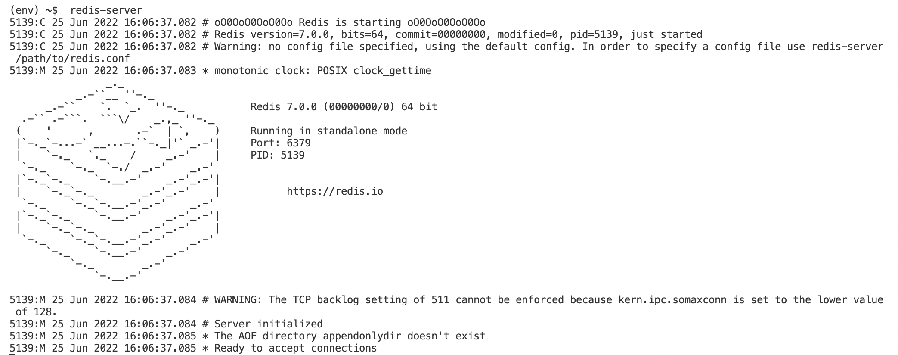
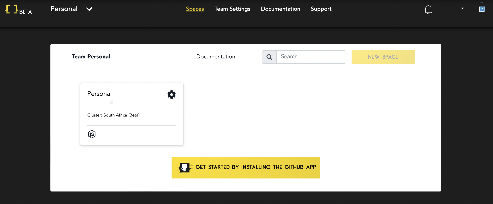
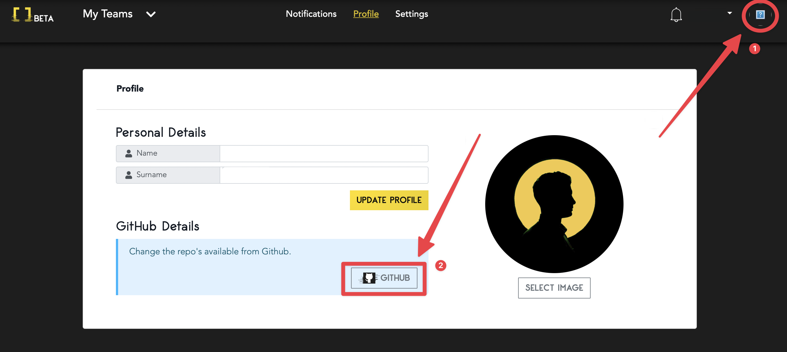
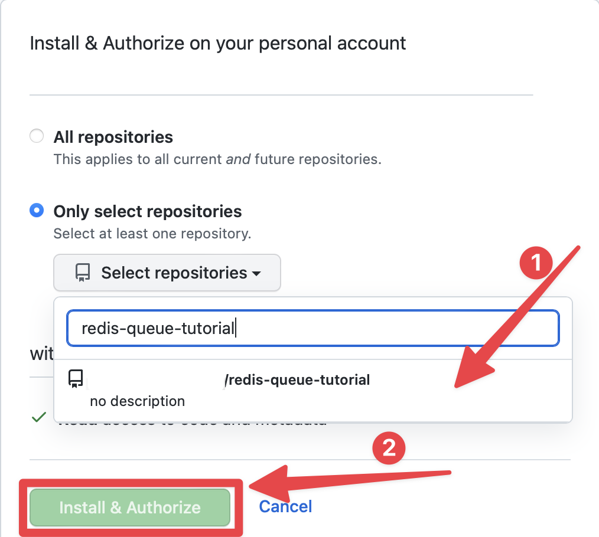
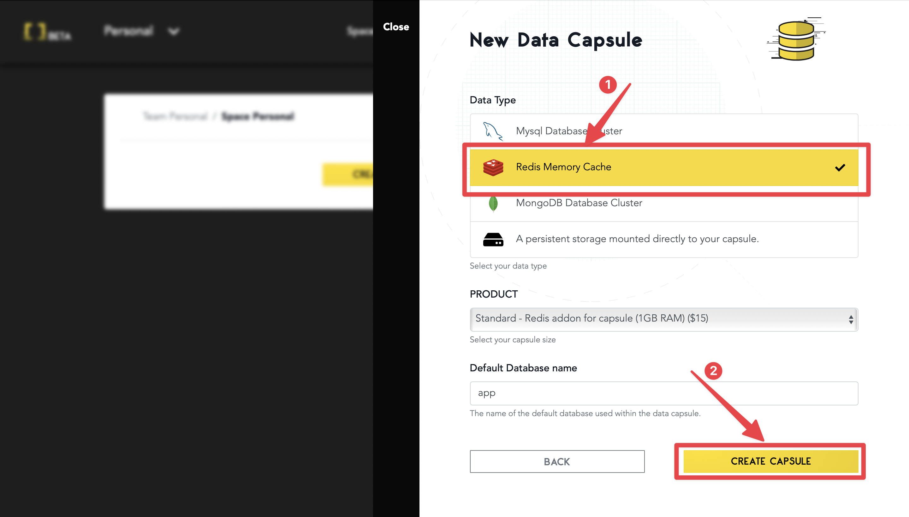
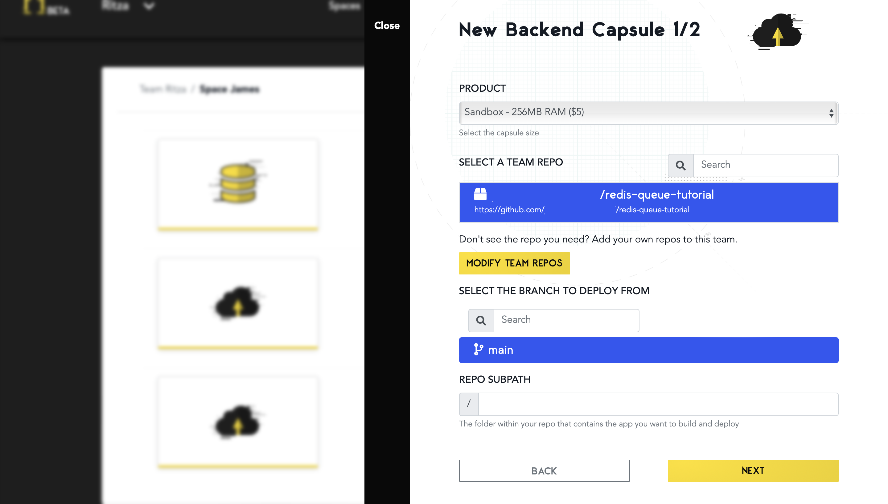
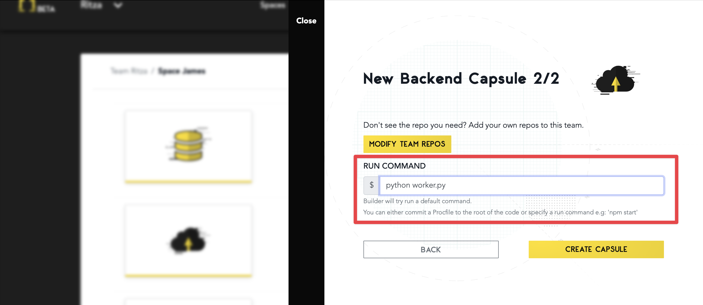
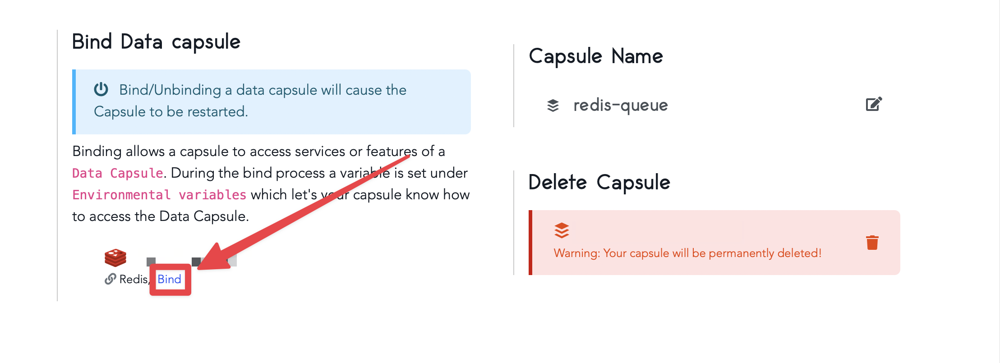
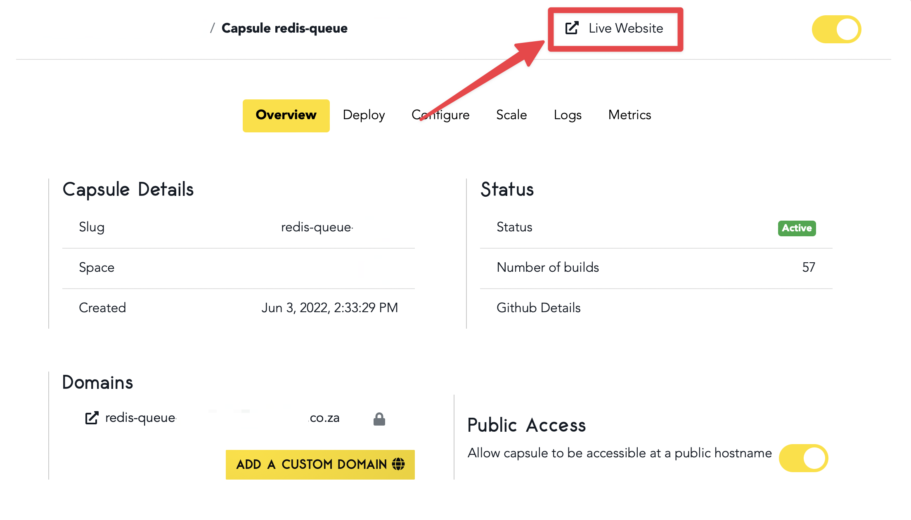

# Building a "Reader Mode" Full Stack Application with Flask and Redis


In this tutorial, we’ll show you how to use a Redis Data Capsule to hold web-scraping tasks in a queue. Those tasks will be completed in a background process, so the user has a smooth, uninterrupted web experience with no tasks slowing the web page down.

Our app will create an ad-free, text-only version of a web page (for example, a [CNN.com](https://edition.cnn.com) article) that the user provides in the form of a URL. 

Our reader mode app will:

- Display a homepage that prompts the user to provide a URL.
- Add a task to a Redis queue to scrape the contents of the given URL as a background process.
- Immediately present the user with a loading page, demonstrating that the background process does not interfere with the loading of new web pages.
- Once the task has been completed from the queue, display an ad-free, text-only version of the web page the user provided.
  

## Overview and Requirements

Make sure you have these technologies and accounts setup and ready to follow this tutorial:

- A text editor, such as [VS Code](https://code.visualstudio.com/download) or [Atom](https://atom.io).
- A registered [GitHub](https://github.com) account and [Git](https://git-scm.com) installed.
- [Python3](https://www.python.org) installed.
- [Redis](https://redis.io/docs/getting-started/installation/) installed on your system.

## Setting up the Project

Now that we have all the requirements in place, we can set up our project. Start by creating and navigating to the project folder by entering these commands in a terminal:

```
mkdir redis-queue-tutorial
cd redis-queue-tutorial
```

From this point on, we'll refer to `redis-queue-tutorial` as the project root folder.

## Creating a Virtual Environment

Creating a virtual environment will allow our Python project to use packages in isolation, avoiding disrupting the dependencies of other projects on the system.

In a terminal, run the following command in the project root folder to create a virtual environment:

```
python3 -m venv env 
```

Activate the virtual environment with one of these commands:

**MacOS**

```bash
source env/bin/activate
```

**Windows**

```
.\env\Scripts\activate
```

After activating the virtual environment, the name we set for the environment, `env`, should appear in your terminal alongside your current line. This means the environment was successfully activated.


## Installing Dependencies

We can now install packages to the virtual environment we created in the previous step. 

Run the command below:

```
pip install flask bs4 redis rq gunicorn lxml
```

These are the packages we install with this command:

- `flask` installs the [Flask web framework](https://pythonbasics.org/what-is-flask-python/), which we'll use to set up views, tasks, and the web application.
- `bs4` installs [Beautiful Soup](https://www.crummy.com/software/BeautifulSoup/bs4/doc/), which we'll use to scrape and parse the HTML from the client's provided URL.
- `redis` installs [Redis](https://redis.io/docs/about/), which we'll use to run a local Redis server and provide the connection to both the local server and the Redis Data Capsule.
- `rq` installs [RQ (Redis Queue)](https://python-rq.org), which we'll use to add jobs to a queue and initialise a worker to work on that queue in a background process.
- `gunicorn` installs [Gunicorn](https://gunicorn.org), which will help Code Capsules set up our project.

## Initialising an Empty Git Repository

From the project's root folder, enter the `git init` command in the terminal to initialise a Git repository for the project. 

Setting up a Git repository allows us to track changes we make to the project and will help us push the app to production from a local machine.

In the root folder, create a `.gitignore` file and add the text below to it:

```
env/
run.py
dump.rdb
```

The `.gitignore` file will stop Git from tracking our virtual environment folder. The virtual environment folder is not needed when pushing the application to production.

## Linking to GitHub

Create a new repository on [GitHub](https://github.com). Then run the command below from the terminal (make sure to replace `username` and `repository_name` with your own):

```
git remote add origin git@github.com:username/repository_name.git 
```
Now the local repository is linked to the external GitHub repository.

## Initialising a Flask App

Now we can start to put our application together.

First we will create our Flask app. Create a new folder called `queue_app` in the root directory. In the `queue_app` folder, create a file called `__init__.py` and paste these lines of code into it:

```python
import os
from flask import Flask
import redis
from rq import Queue

app = Flask(__name__)

r = redis.Redis()

q = Queue(connection=r)

from queue_app import views
from queue_app import tasks
```

The code in the `__init__.py` file initialises a Flask app, connects to a local Redis server, and creates a queue that will store our tasks later. 

The database we are currently connecting to is our local Redis server, but later we will change this to connect to the Redis Data Capsule through an environment variable.

This file also imports the views and tasks we will be creating later on.

## Creating the Homepage 

Next we will create the `.html` file for our homepage. Inside the `queue_app` folder, create a new folder called `templates`. In the `templates` folder, create a new file called `index.html`, and paste the following code in it:

```html
<!DOCTYPE html>
<html lang="en">
<head>
    <meta charset="UTF-8">
    <meta http-equiv="X-UA-Compatible" content="IE=edge">
    <meta name="viewport" content="width=device-width, initial-scale=1.0, shrink-to-fit=no">
    <link rel="stylesheet" href="https://cdn.jsdelivr.net/npm/bootstrap@4.3.1/dist/css/bootstrap.min.css" integrity="sha384-ggOyR0iXCbMQv3Xipma34MD+dH/1fQ784/j6cY/iJTQUOhcWr7x9JvoRxT2MZw1T" crossorigin="anonymous">    
    <link rel="stylesheet" href="{{ url_for('static', filename='styles.css') }}">
    <title>Job Queue</title>
</head>
<body>
    <div class="jumbotron jumbotron-fluid">
        <h5 class="mt-3">Reader Mode</h5>
        <div class="card-body">
            <form action="/">
                <div class="form-group">
                    <label>Enter the url of the webpage you would like to read:</label>
                    <input type="url" class="form-control" name="url" placeholder="Enter URL" required>
                </div>
                <button type="submit" class="btn btn-primary">Submit</button>
            </form>
        </div>
    </div>    
</body>
</html>
```

This is a simple HTML page with a form, input, and button that prompts the user to submit a URL. The page also has some styling, which we will address later. This page’s form will allow the user to send a request to our app with the URL attached to that request.

## Creating a View for the Homepage

Now let’s create the view that will render the homepage HTML and handle requests from the user. 

Inside the `queue_app` folder create a new file called `views.py` and paste this code inside:

```python
import hashlib

from queue_app import app
from queue_app.tasks import scrape_url
from queue_app import q 
from queue_app.__init__ import r

from flask import redirect, render_template, request, url_for

from rq.job import Job

@app.route("/", methods=["GET", "POST"])
def add_task():
    if request.args:
        url = request.args.get("url")
        job_id = hashlib.md5(url.encode()).hexdigest()
        q.enqueue(scrape_url, url, job_id = job_id, result_ttl=5000)
        return redirect(url_for(f"get_results", job_key=job_id))
    return render_template("index.html")
```

Here we create a view that returns the homepage for the user. It also detects whether the user has submitted a request and if so it does a few things:

- Retrieves the URL from the request.
- Creates a unique ID for the URL using the hashlib module.
- Adds a task to the queue with the URL for processing.
- Redirects to the final results webpage view.

Next we need to create the task that will scrape the user's URL, and the final results page to display the tasks results.

## Creating a Task

In the `queue_app` folder, create a new file called `tasks.py` and add the following lines of code:

```python
from urllib import request
from bs4 import BeautifulSoup

def scrape_url(url):
    try:
        r = request.urlopen(url)

        if "cnn" in url:
            tag_text = "div"
            class_text = "zn-body__paragraph"
        else:
            tag_text="p"
            class_text = None

        soup = BeautifulSoup(r.read().decode(), "lxml")
        title = soup.title.text
        paragraphs = [p.text for p in soup.find_all(tag_text, class_text)]
        return paragraphs, title
    except Exception as e:
        print(e)
        paragraphs = ["The url you submitted is invalid or cannot be scraped."]
        title = "Failed to access url"
        return paragraphs, title
```

This file creates the `scrape_url` function that takes in the user's URL as an argument. 

In this function a few things happen:

- It checks if the URL can be accessed by opening the URL in a `try` block.
- It then checks if the URL is from CNN's website (CNN holds their text in divs) and provides the HTML tags and classes that contain the main news articles for those sites.
- If the URL isn’t from CNN, it grabs all the paragraph tags from that site.
- It uses BeautifulSoup to scrape the HTML from the URL, and extract the title and body text from the URL.
- It returns the results as a tuple.
- If the URL can't be scraped, it returns an error message in place of the title and paragraphs.

## Adding the HTML for the Results Page

Next we will add the HTML for the results web page. Inside the `templates` folder, create a file called `results_page.html` and paste the following code into it:

```html
<!DOCTYPE html>
<html lang="en">
<head>
    <meta charset="UTF-8">
    <meta http-equiv="X-UA-Compatible" content="IE=edge">
    <meta name="viewport" content="width=device-width, initial-scale=1.0, shrink-to-fit=no">
    <link rel="stylesheet" href="https://cdn.jsdelivr.net/npm/bootstrap@4.3.1/dist/css/bootstrap.min.css" integrity="sha384-ggOyR0iXCbMQv3Xipma34MD+dH/1fQ784/j6cY/iJTQUOhcWr7x9JvoRxT2MZw1T" crossorigin="anonymous">
    <link rel="stylesheet" href="{{ url_for('static', filename='styles.css') }}">
    
        <title>{{title}}</title>
    
        <title>Reader Mode Loading</title>
    
</head>
<body>
    
    <div class="jumbotron jumbotron-fluid">
        <h1>{{ title }}</h1>
        <br>
        
            <p>{{paragraph}}</p>
        
    </div>
    
        <div class="jumbotron jumbotron-fluid" id="load-page">
            <script>setTimeout(() => {location.reload(true)}, 5000)</script>
            <h1>Your request is in the queue.</h1>
            <p>Current number of jobs in the queue: {{ q_len }}</p>
            <p>This page will refresh every 5 seconds until your job has been completed.</p>
            <div class="loader"></div>
        </div>
    
</body>
</html>
```

This page checks to see if a body text has been returned by the queued task. If not, it displays some text informing the user that the result is loading, as well as the number of items in the queue. If the results haven’t been returned, the page will reload every five seconds until they have returned.

Once the results are returned, the page displays the title and paragraphs returned from the task.

## Creating a View for the Results Page

Now we will create the view that will render the `results_page.html` HTML. The view will also check the queue for the user's completed task and return the results once complete.

Open up the `views.py` file and append these lines of code to the end of the file:

```python
@app.route("/results/<job_key>", methods=['GET'])
def get_results(job_key):

    q_len = len(q.jobs) + 1
    job = Job.fetch(job_key, connection=r)

    # Print errors to console
    try:
        if type(job.result) != "list":
            print(job.result)
        elif job.result[2]:
            print(job.result[2])
    except:
        pass

    if job.is_finished:
        return render_template("results_page.html", paragraphs=job.result[0], title = job.result[1]), 200
    else:
        return render_template("results_page.html", paragraphs=False, q_len=q_len), 202
```

This view takes the user's task ID as `job_id` and fetches that job from the queue. It then checks if the job is complete. If so, it returns the rendered HTML with the arguments needed to display the text. If the task is not complete yet, it returns the rendered HTML with the arguments needed to display the loading page.


## Creating the Worker 

Now we need to create the worker that will listen to our Redis server and work on the queue when tasks are added. In the project root directory, create a file called `worker.py` and paste the following lines of code in it:

```python
import os
import redis
from rq import Worker, Queue, Connection

listen = ['default']
conn = redis.Redis()

if __name__ == '__main__':
    with Connection(conn):
        worker = Worker(list(map(Queue, listen)))
        worker.work()
```

This worker connects to our Redis server, and when run, creates a worker linked to our Redis queue. The worker will listen to the queue, and when jobs are added, it will perform the tasks in the queue one at a time.

## Adding Styling for the HTML 

The two HTML pages we have created so far use Bootstrap styling that you can see linked in the head of the file.

Flask requires a particular file structure for static files. In the `queue_app` folder, create a folder called `static`. In the `static` folder, create a file called `styles.css` and paste in the following lines of code:

```css
.jumbotron{
    text-align: left;
    margin:  2% 10%;
    padding: 2% 15%;
}

.loader {
    border: 16px solid #f3f3f3; /* Light grey */
    border-top: 16px solid #c7ccce; /* Blue */
    border-radius: 50%;
    width: 120px;
    height: 120px;
    animation: spin 2s linear infinite;
    margin: auto;
  }
  
  @keyframes spin {
    0% { transform: rotate(0deg); }
    100% { transform: rotate(360deg); }
  }

#load-page{
    text-align: center;
}

@media only screen and (max-width: 600px) {
  h1 {
    font-size: 25px;
  }
  .jumbotron{
    margin: 0;
  }
}
```

This CSS will format our text on the homepage and results page. It also adds some responsiveness for smaller screens, and gives some animation to the loading screen we created.

In the head of your file, you might have noticed this link to a style sheet:

```html
<link rel="stylesheet" href="{{ url_for('static', filename='styles.css') }}">
```

This links to the CSS file we created using the `url_for` function.

## Testing Locally

In the project's root folder create a file called `run.py` and add the following code:

```python
from queue_app import app 
```

Now to test our application, we will need three terminal windows. 
 
In the first window, we can run our Flask app. Enter these lines into your terminal to run the app:

```bash
export FLASK_APP=run.py
flask run 
```

You should see this output in your terminal, which shows your web application is running on your local host:


You can click the link to open your homepage in your browser.



Our webpage is up, but we still need to start up our local Redis server and `worker.py` if we want our webpage to have any functionality.

In a new terminal, run the following line of code:

```bash
redis-server
```

This will start up your local Redis server and will show this output:



Next we need to start up our worker. In a new terminal window, run the following command:

```bash
python worker.py
```

**Note** On macOS you may need to run the following command to allow multiprocessing in the worker before running the command
above which starts the worker:

```bash
export OBJC_DISABLE_INITIALIZE_FORK_SAFETY=YES
```

This will start up your worker, which will begin listening to the Redis server. You should see this output:


Now we can try out the web app by inserting a URL into the form and clicking "Submit". 

You should see a page loading. 


This means the job is in the queue, but has not been completed yet. The page will refresh every five seconds until the results from the job are returned by the task. 

When the results are in, the webpage should show an output like this on the next refresh:


Now that our app is working, we can prepare for deployment on Code Capsules. 

## Preparing for Deployment

First we need to change the Redis connection in the `worker.py` and `__init__.py` files to ensure that they connect to the Redis Data Capsule we will create, rather than our local Redis server. 

Replace the code in the `worker.py` file,  with the lines of code below:

```python
import os
import redis
from rq import Worker, Queue, Connection

listen = ['default']
redis_url = os.getenv('REDIS_URL')
conn = redis.from_url(redis_url)

if __name__ == '__main__':
    with Connection(conn):
        worker = Worker(list(map(Queue, listen)))
        worker.work()
```

Replace the code in the `__init__.py` file, with the code below:

```python
import os
from flask import Flask
import redis
from rq import Queue

app = Flask(__name__)
redis_url = os.getenv('REDIS_URL')
r = redis.from_url(redis_url)
q = Queue(connection=r)

from queue_app import views
from queue_app import tasks
```

Here we connect our app to the Redis Data Capsule we will create by accessing an environment variable called `REDIS_URL`.

This environment variable will be defined by Code Capsules once we have created our Redis Data Capsule and Backend Capsules. 

## Creating a Procfile and `requirements.txt`

Now we need to create a `Procfile`. This file tells Code Capsules which application to run as our web application through the `gunicorn` module. 

Create a file called `Procfile` in the project root directory and paste in the following text:

```
web: gunicorn queue_app:app
```

Next, create a `requirements.txt` file, which is a file that contains the information about our project's dependencies. Code Capsules will use this file to deploy our application. 

In the command line, make sure you are in the project root folder and enter this command:

```
pip freeze > requirements.txt
```

## Pushing Files to GitHub

Next we will push our code to our Git repository with the following commands in the terminal:

```
git add .
git commit -m “commit message”
git branch -M main
git push -u origin main
```

Finally, we will create our capsules. We need to create three capsules, our Redis Data Capsule, a Backend Capsule for our worker process, and another Backend Capsule for our web app.

## Logging in to Code Capsules

Go to the [Code Capsules website](https://codecapsules.io), create an account, and login. 

After logging in, you’ll see a page like the one below:



When creating a Code Capsules account, a Personal Team is created by default. A Team is great for collaborative development, as you can invite people to work on and view your applications. 

## Connecting to GitHub
Now we need to connect our GitHub account to our Code Capsules account so that our applications can be pulled from GitHub repositories. 

Do this by clicking the profile image button on the top right of the screen and then finding and clicking the GitHub button. 


 
Log in to your GitHub account, select your username, press “Only select repositories”, and then select the repository containing your project from the list. Finally press "Install & Authorize".



## Creating a Redis Database Capsule

Next we can enter our "Personal Space" and create a capsule. A Space allows you to organise one or more capsules together. Inside this Space, create a new capsule.

The first capsule we will create is the Redis Data Capsule. Select "Data Capsule" from the list and then select "Redis Memory Cache". 

 

 

 

## Creating a Backend Capsule for the worker

Next we will create the capsule that will run our worker. Create a new capsule, select "Backend Capsule" type, and then select your GitHub repository in the list . 

Now enter `python worker.py` in the run command. This build command will provide special information to the capsule about how it should be built. The command we entered tells the capsule to run the worker as the main app rather than the Flask web application. 

 



The next step is to bind our capsule to our Redis Data Capsule. Do this by going to the "Configure" tab of your Backend Capsule and then scroll to the "Bind Data capsule" section. Click on the "Bind" button to bind the capsules.



## Creating a Backend Capsule for the Flask Web App

Now to create a capsule for our Flask application. Create a new Backend Capsule and link it to your GitHub repository. 

Do not add a build command, as the `Procfile` we created will run our Flask app for us. 

The next step is to bind our capsule to our Redis Data Capsule. Do this by going to the "Configure" tab of your new Backend Capsule and selecting "Bind" in the "Bind Data capsule" section.

Wait for the web app capsule to finish building, and then select "Live Website" to see the live app. 



Our web application has now been deployed through Code Capsules and can be reached by anyone who has our URL.

## Running the Web and Worker processes in the same capsule

We created two Backend Capsules for this project because running two processes (the web process and worker process) on the same capsule will not scale properly in practice. If you wish to run both processes on the same capsule, to save money on a smaller project that will not need to scale, there is a method to do this.

To use one Backend Capsule to run the web app, create a file called `codecapsules.sh` in your project root directory. In that file paste the following text:

```
gunicorn queue_app:app —daemon
python worker.py
```

Then change the `Procfile` text to the following:
```
web sh codecapsules.sh
```

Now create a single Backend Capsule, link it to your GitHub repository, and do not add a build command. Bind it to your Redis Data Capsule, and once it has finished building, it should deploy with the web process daemonised in the background and the worker in the foreground.

# Next Steps

In this tutorial, we made use of background processing to handle tasks in order to improve the user's experience. You could expand on this by:

- Routing the user to a more exciting page than our current load page.
- Add functionality to email the final document to the user.
