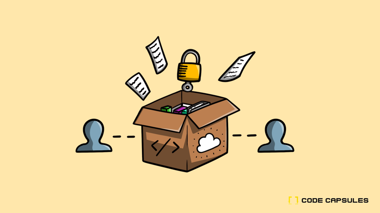
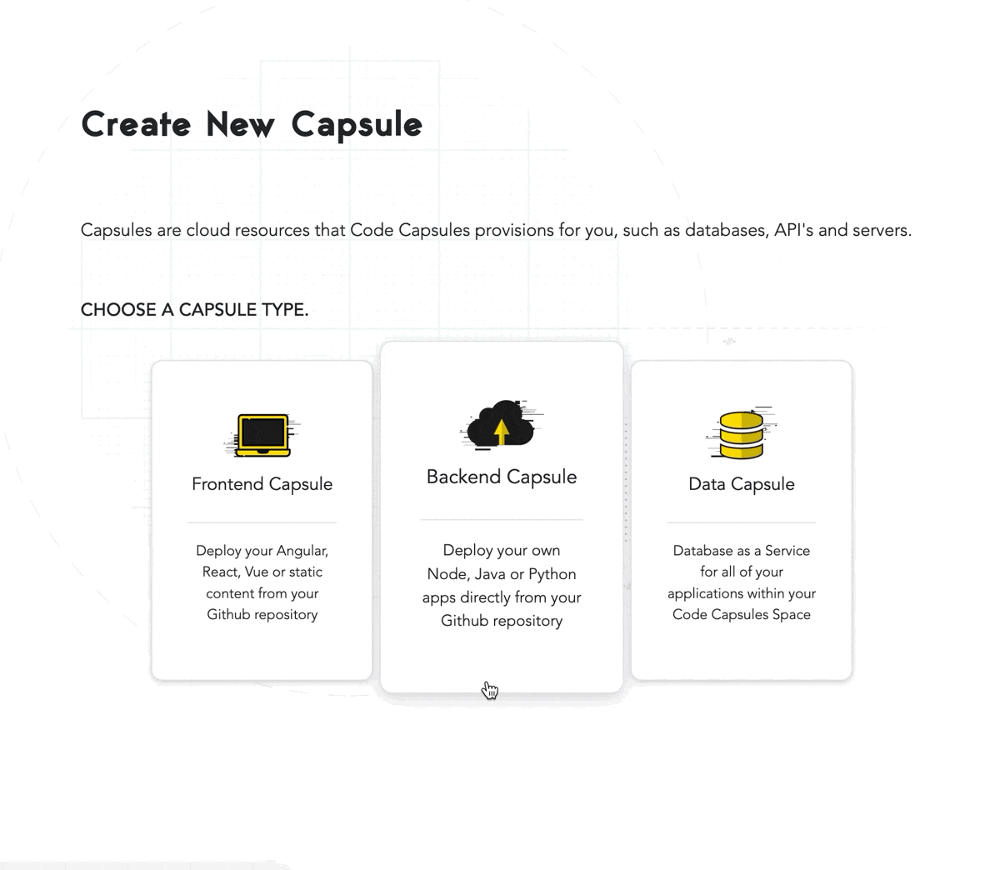
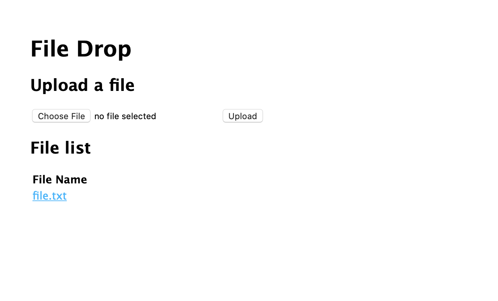
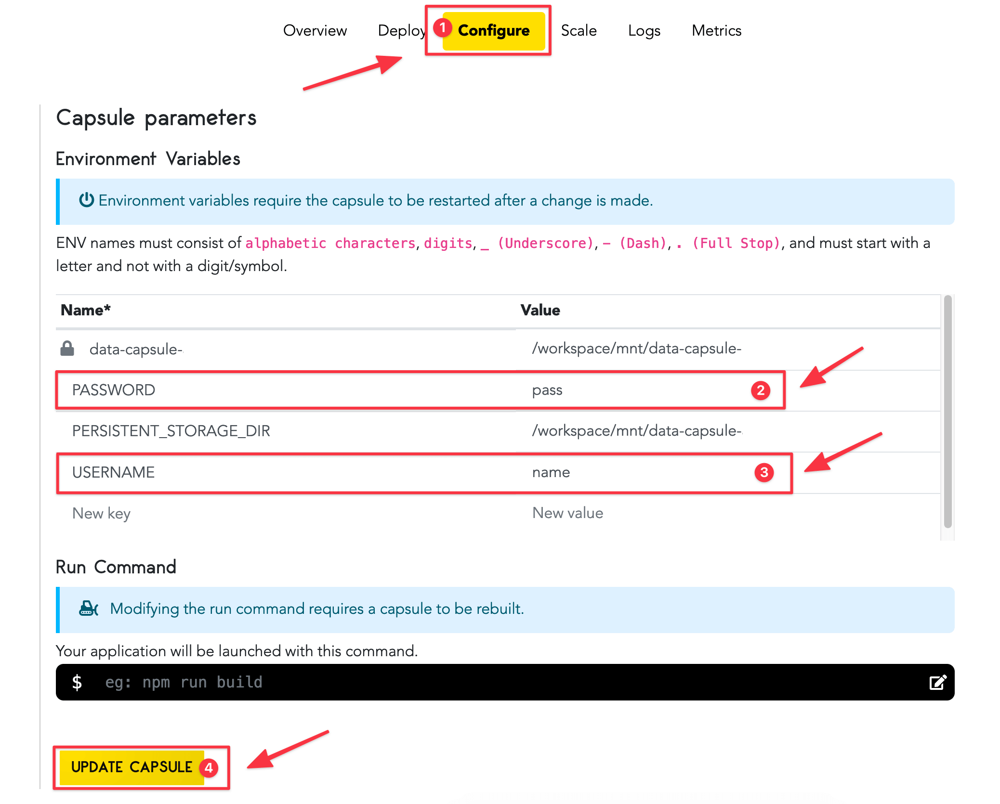

# Building a Web File Store



An online file storage drive you can access from all your devices is a very useful tool. It's the basis of services like Dropbox and Google Drive. 

Code Capsules's File System Data Capsule mounts as a standard file system to a Backend Capsule, providing a convenient file storage option you can use instead of a blob store on other platforms. The file systems are well supported in most programming languages and familiar to programmers.

In this tutorial, we'll build a basic web interface to upload, download and delete files, secured with a simple, single-user authentication scheme.

We'll use a [Backend Capsule](https://codecapsules.io) with a file store Data Capsule, [Node.js](https://nodejs.org/) as the programming language, and [Express](http://expressjs.com) as the web framework.

## Overview and Requirements

You'll need the following services and software set up for this tutorial 

- [Git](https://git-scm.com) set up and installed, and a registered [GitHub account](https://github.com).
- [Node.js](https://nodejs.org/) installed.
- A registered [Code Capsules](https://codecapsules.io) account.
- An IDE or text editor to code the project in. We used [Visual Studio Code](https://code.visualstudio.com) in this tutorial, but you can use any tool you like.

## Setting Up The Project

With our requirements in place, let's get started setting them for our web file store project.

### Creating a New Repo 

First, we need a place to store our code, from which [Code Capsules](https://code.visualstudio.com) can deploy it to a capsule.

Head over to [GitHub](https://github.com) and create a new repo. We're calling it _filedrop_ here, but you can call it whatever you like. You can choose a **Node** `.gitignore` file to get started. Clone the new GitHub repo onto your computer and navigate to that directory in terminal (or command prompt, if you're on Windows).

### Initializing the Base Project

We'll use the [Express.js application generator](http://expressjs.com/en/starter/generator.html) to create the project base. Type in the following: 

```bash
npx express-generator --hbs 
npm install
```

Here we've created a few files and folders that we can edit. The `--hbs` option tells the generator to use [Handlebars](https://handlebarsjs.com) as the HTML template language. We're using Handlebars as it's close to plain HTML, making it easier to pick up quickly.

The command `npm install` downloads and installs all the dependencies and packages required by the base project. Open the folder with [Visual Studio Code](https://code.visualstudio.com) or your chosen editor, and browse through the files to get familiar with them. The `app.js` file in the project root is the main entry point for the app. 

It's time to push this boilerplate project up to Git. Type the following into command prompt or terminal: 

```bash
git add . 
git commit -am 'added base files for project'
git push origin
```

### Creating a New Backend Capsule 

Now we need a place to host our app. 

1. Log in to [Code Capsules](https://codecapsules.io), and create a Team and Space for this project.
2. Link [Code Capsules](https://codecapsules.io) to the [GitHub](https://github.com) repository created above. You can do this by clicking your username at the top right, and choosing _Edit Profile_. Now you can click the _Github_ button to link to a repo. 
3. Create a new Capsule, selecting the "Backend" capsule type.
4. Select the GitHub repository we created and linked to. If you're only using the repo for this project, you can leave the _Repo Subpath_ field empty. You may need to add your repo to the team repo if you haven't already. Click the _Modify Team Repos_ to do so. 
5. Click _Next_, then on the following page, click _Create Capsule_.



### Creating a New Data Capsule 

We'll need some data storage to store the files uploaded to the web drive. 

1. Create a new Capsule, selecting the "Data Capsule" type.
2. Select "A persistent storage mounted directly to your capsule" as the Data Type. Choose a product size, and give the capsule a name.
3. Click "Create Capsule".


### Linking the Capsules

To use the Data Capsule with the Backend Capsule, we need to link the two. Head over to the backend capsule you created earlier, and click on the "Configure" tab. Scroll down to "Bind Data Capsule", and click "Bind" under the name of the data capsule you created. 


After binding the capsules, scroll up to the section "Capsule Parameters". You'll notice that an environment variable, `PERSISTENT_STORAGE_DIR`, is automatically added with the mount point. We'll use this environment variable in the code to access the storage drive.


## Writing the Web Files Code

Now that we have all our systems setup, we can get onto the best part - coding!

### Getting the File List

Open the file `index.js` in the `routes` folder of our project. This is the server code file for the default route `/` in the application. We'll use this route to show the file listing. 

To interact with the storage capsule and the files on it, we'll use the built-in [`fs`](https://nodejs.org/api/fs.html#fs_file_system), or file system, module included in Node.js. Add a reference to this module at the top of the file:

```javascript
const fs = require('fs');
```

Then, modify the default `get` route to use the `fs` module to get the file listing on the storage drive: 

```javascript
router.get('/', function(req, res, next) {
  fs.readdir(process.env.PERSISTENT_STORAGE_DIR, function(err, files){
    if (err) return res.sendStatus(500); 
    files.sort(); 
    return res.render('index', {title: "File Drop", files: files}); 
  }); 
});
```

This code uses the [`readdir`](https://nodejs.org/api/fs.html#fs_fs_readdir_path_options_callback) function to get an array of all the files in the storage drive. Note that we use the environment variable that was automatically setup when we bound the capsules to specify the path to the storage drive. Environment variables are accessible through the [`process.env`](https://nodejs.org/api/process.html#process_process_env) object in Node.js.

The [`readdir`](https://nodejs.org/api/fs.html#fs_fs_readdir_path_options_callback) function calls a callback function once it has the file list. The callback has 2 arguments: `err`, which will contain an error object if the folder could not be read, and `files`, which is a string array of all the filenames in the folder, if the call was successful. 

If the `err` object is populated, we immediately return with an [HTTP code `500`](https://en.wikipedia.org/wiki/List_of_HTTP_status_codes#5xx_server_errors) using the `sendStatus` function. The code `500` means that the server encountered an error processing a request, so the browser can show an error page. 

Since the [`readdir`](https://nodejs.org/api/fs.html#fs_fs_readdir_path_options_callback) function doesn't return the files in any order, we use the built-in [array `sort` function](https://developer.mozilla.org/en-US/docs/Web/JavaScript/Reference/Global_Objects/Array/sort) to sort the files. By default, the sort function sorts the files in ascending alphabetical order. If you'd like a different sort order, you can supply a function to customise the behaviour here. 

The sorted files can now be returned to the browser. We call the [`res.render`](http://expressjs.com/en/4x/api.html#res.render) function, which specifies the Handlebars template to use as the return web page. The templates are stored in the `views` folder of the project. The function also accepts a data object as an argument. [Handlebars](https://handlebarsjs.com) then combines this data with the template to fill in the values on the page.

### Rendering the File List

Our backend route gets the file list, and passes it through to the `index` HTML template. Let's customise that template to display the files. Open `index.hbs` in the views folder, and update the contents to this code:

```html
<h1>{{title}}</h1>

<div>
  <h2>File list</h2>
  <table>
    <tr>
      <th>File Name</th>
    </tr>
      {{#each files}}
      <tr>
        <td> 
            {{this}}
        </td>
      </tr>
      {{/each}}
  </table>
</div>
```

Handlebars uses the sequence `{{ }}` to indicate sections of the template to be populated. In the first line, `{{title}}` will be replaced with the title we specified in the return from the `GET / ` route we added earlier.

Then we set up a simple table, and use the [Handlebars each](https://handlebarsjs.com/guide/builtin-helpers.html#each) function to iterate over the elements in the `files` array we passed from the `Get / ` route. The Handlebars keyword `{{this}}` is used to reference the current file name on each iteration. 

You can save, commit and push your changes so far. Our code should deploy automatically on [Code Capsules](https://codecapsules.io). After deploying, you can visit the public URL, and you should see something like this:


This is good, but a little uninteresting without any files to view!

### Adding the File Upload Route

Let's add functionality to upload a file, then we'll be able to view it in the list. We'll first add an [HTML upload form](https://www.w3schools.com/html/html_forms.asp) to the `index.hbs` file in the `views` folder. Add this code under the `<h1>{{title}}</h1>` line: 

```html
<div>
  <h2>Upload a file</h2>
    <form ref='uploadForm' 
      id='uploadForm' 
      action='/' 
      method='post' 
      encType="multipart/form-data">
        <input type="file" name="newFile" />
        <input type='submit' value='Upload' />
    </form> 
</div>
```
This code adds in a new HTML form, which makes a `POST` request to the root `/` (our index page) on submit. We've given the form 2 inputs: a file upload field specified by the `type="file"` attribute, and the submit button. Note the `name` given to the file input - we'll need to remember this when processing the upload on the server side. 

Now that we have a way for the user to select a file to upload and send to the server, we need to create a route to process the submitted file. In the `index.js` file in the  `routes` folder, we'll add a new HTTP route. This one will be a [POST](https://en.wikipedia.org/wiki/Hypertext_Transfer_Protocol#Request_methods) route, as we are using it to upload a new file (or resource) onto the server. Add this stub for the route in the `index.js` file: 

```js
router.post('/', function(req, res){

}); 
```
To handle file uploads with Express, we'll use a package that takes care of all the encoding and streaming concerns of file uploads. Open up the terminal and install the [`express-fileupload`](https://www.npmjs.com/package/express-fileupload) package using npm: 

```bash
npm install express-fileupload
```
To use this package, we need to add it into the [middleware](http://expressjs.com/en/guide/using-middleware.html) of our Express server. Open up the `app.js` file in the root folder of the project, and import the package by adding the following `require` statement at the top of the file:

```js
const fileUpload = require('express-fileupload');
```

Now insert the package into the Express middleware pipeline by adding the following line just under the `var app = express();` statement:

```js
app.use(fileUpload());
```

The `express-fileupload` module adds a `files` attribute to our `req` object. Through the `files` attribute we can access any uploads as their own objects, which are named the same as the HTML form `inputs`. 

Now we can expand on the route stub. In the `index.js` file, complete the `POST` route as follows:

```js
router.post('/', function(req, res){
  
    if (!req.files || Object.keys(req.files).length === 0) {
      return res.status(400).send('No files were uploaded.');
    }
  
    const newFile = req.files.newFile;
    const uploadPath = process.env.PERSISTENT_STORAGE_DIR + '/' + newFile.name;
  
    newFile.mv(uploadPath, function(err) {
      if (err) return res.status(500).send(err);
      return res.redirect('/');
    });

});
```
First, we check whether the `files` object exists on the route, and if it does exist, we check whether it has sub-objects on the list (no sub-objects means no form `input` fields were populated). If no `files` objects or sub-objects exist on the route, there is no file for the code to process, so we return early with an [HTTP status `400`](https://en.wikipedia.org/wiki/List_of_HTTP_status_codes#4xx_client_errors) code and a message to the user. Status code `400` means there is an input error from the user side. 


Otherwise, having established that a file has been uploaded, we get the file object by referencing the same name we gave to our HTML input field (`newFile`) on the `files` object that the `express-fileupload` package added to the `req` object. Now that we have the file object, we can construct a path to the data capsule's location to save the file. We use the environment variable for the data capsule mount point (located in the Backend Capsule's "Capsule Parameters"), along with the path separator `/` and the name of the uploaded file. You can see all the properties available on the file object at the [`express-fileupload` npm page](https://www.npmjs.com/package/express-fileupload). 


All we need to do now is to save the file to the upload path. The `express-fileupload` package provides the method `mv` on the file object to save the file to a disk location. It then calls a provided callback function when done, or if an error occurs. If we get a error back, we send an [HTTP code `500`](https://en.wikipedia.org/wiki/List_of_HTTP_status_codes#5xx_server_errors) back to the client, which means that there was an error on the server side. Otherwise, if all goes well, we redirect the client to the index `/` page, which will call the `GET` route added earlier to refresh the file list on the client side.

This is a good point to commit the code to Git, and test the new deployment on Code Capsules. After the capsule finishes rebuilding, navigate to the site. It should look something like this:


The upload control may look slightly different depending on the web browser and operating system you use. Try choosing a file and uploading it, and you should see it appear in the browser.

### Downloading a File

We've got the functionality to upload files, and to list what files are on the server. Now let's add functionality to download files. 

We'll add a route with the format `/filename` to get the requested file. We'll make use of the [`download`](http://expressjs.com/en/5x/api.html#res.download) functionality built into Express to send the file back to the browser. 

Add this route to the `index.js` file.

```js
router.get('/:filename', function(req, res, next){
    const filepath = process.env.PERSISTENT_STORAGE_DIR + '/' + req.params.filename; 
    return res.download(filepath); 
}); 

```
This sets up a `GET` route, with the requested filename as a parameter. Then the function constructs a path to the file, using the environment variable for the data capsule mount point, along with the path separator `/` and the name of the requested file.

Then we call the [`download`](http://expressjs.com/en/5x/api.html#res.download) method on the `res` (result) object with the constructed path. This sends the file to the browser. 

Now we need a way to call this route from the front end. Open the `index.hbs` file in the `views` folder, and modify the `{{this}}` template in the file list table to an HTML [anchor `<a>` tag](https://www.w3schools.com/tags/tag_a.asp), with the `href` to the route we added above. We'll also add the [`download`](https://www.w3schools.com/tags/att_a_download.asp) attribute to the tag so that the link will not be opened in the browser, but downloaded instead. The updated file list table should look like this now: 

```html
<div>
  <h2>File list</h2>
  <table>
    <tr>
      <th>File Name</th>
    </tr>
      {{#each files}}
      <tr>
        <td> 
            <a href='/{{this}}' download>{{this}}</a> 
        </td>
      </tr>
      {{/each}}
  </table>
</div>
```

Commit these changes, and wait for Code Capsules to redeploy the site. If you navigate to the site now, you should see the file you uploaded earlier as a hyperlink. Clicking on the link should download the file.



### Deleting a File

Now that we can upload and download files, we'll probably also need to remove files. We can use the [HTTP `DELETE` verb](https://en.wikipedia.org/wiki/Hypertext_Transfer_Protocol#Request_methods) on a route for this. 

Since the data capsule appears just like a regular file system to our code, we can use the built-in Node.js [`fs`](https://nodejs.org/api/fs.html#fs_file_system) module here again. It has a method called [`unlink`](https://nodejs.org/api/fs.html#fs_fs_unlinksync_path) which deletes a file from a file system. We supply it with a path to the file, and a callback function to let us know the result of the delete file request. If we get an error, we'll send an [HTTP code `500`](https://en.wikipedia.org/wiki/List_of_HTTP_status_codes#5xx_server_errors) status back to the browser, to let the browser know that an error occurred. If the delete action is successful, we'll send a status code [`200`](https://en.wikipedia.org/wiki/List_of_HTTP_status_codes#2xx_success), which lets the browser know that the operation was a success. Add this code to the `index.js` file to implement the `DELETE` route: 

```js
router.delete('/:filename', function(req, res){
  const filepath = process.env.PERSISTENT_STORAGE_DIR + '/' + req.params.filename; 

  fs.unlink(filepath, function (err) {
    if (err) return res.sendStatus(500); 
    else return res.sendStatus(200); 
  }); 

}); 
```

Now let's update the front end to be able to call this route. Open the `index.hbs` file, and add a new header column to the file table, along with a button for each file in the new column to delete it:

```html
<div>
  <h2>File list</h2>
  <table>
    <tr>
      <th>File Name</th>
      <th></th>
    </tr>
      {{#each files}}
      <tr>
        <td> 
            <a href='/{{this}}' target="_blank">{{this}}</a> 
        </td>
        <td>
          <button>Delete</button>
        </td>
      </tr>
      {{/each}}
  </table>
</div>

```

Next we'll create some front-end JavaScript code for the button to call when clicked. We'll use the browser-side [`fetch`](https://developer.mozilla.org/en-US/docs/Web/API/Fetch_API) function to call the `DELETE` file route. Add this script block at the bottom of the `index.hbs` file: 

```js
<script type="text/javascript">
  function deleteFile(filename){

    var confirmation = confirm('Do you really want to delete the file ' + filename + '?'); 
    if (confirmation === true){
      fetch('/' + filename, { method: 'DELETE' })
      .then(response => location.reload())
      .catch(error => alert('Error deleting the file! ' + error)); 
    }
  }
</script>
```

This adds a new function `deleteFile` to the front-end index page. It has one argument: the name of the file to delete. First, we make use of the built-in [`confirm`](https://developer.mozilla.org/en-US/docs/Web/API/Window/confirm) function which exists in all browsers. This brings up a dialog box with the message _Do you really want to delete the file?_, just to make sure the user didn't click the delete button accidentally. If the user clicks "Yes", the dialog box returns a `true` value. Then we call our `DELETE` route using [`fetch`](https://developer.mozilla.org/en-US/docs/Web/API/Fetch_API). We need to pass in the route to call, and we also send an [init](https://developer.mozilla.org/en-US/docs/Web/API/WindowOrWorkerGlobalScope/fetch#parameters) object which specifies that the `DELETE` HTTP verb must be used to call this route.

The [`fetch`](https://developer.mozilla.org/en-US/docs/Web/API/Fetch_API) function returns a `promise`. This is an alternative to callbacks. If the call was successful, the code in the `.then()` handler is called. This reloads the page, so that the file listing is updated to show that the file is now deleted. If the call fails, the code in the `catch` handler is called. This uses another standard browser dialog, an [`alert`](https://developer.mozilla.org/en-US/docs/Web/API/Window/alert), to let the user know that something went wrong. 

Now let's hook this function up to the button we added for each file. We'll use the [`onclick`](https://www.w3schools.com/jsref/event_onclick.asp) event on the buttons to call the function, along with the filename to be deleted. Update the button code like this: 

```html
<button onclick="deleteFile('{{this}}')">Delete</button>
```

Commit these changes, and wait for Code Capsules to redeploy the site. Then navigate to the site and try out the "Delete" button next to the filename.


### Adding Authentication

We've created the basic functions of a web drive, but anyone can get to the site and upload, download or delete documents. We need a way to control access. For this tutorial, we'll implement a very simple access control system that only allows access to one pre-defined user.

We're going to use [Passport](http://www.passportjs.org) to handle our access control. Passport is a modular package that allows for very simple authentication schemes to very elaborate ones, so you can upgrade the security of this app as you need.

Our basic access control scheme is a username and password combination, entered on an HTML form that is posted to a `login` route. A [session cookie](https://en.wikipedia.org/wiki/HTTP_cookie) will remember the logged-in user while they use the site, and we'll use the package [`express-session`](https://www.npmjs.com/package/express-session) to manage the session. 

Passport's [local strategy](https://www.npmjs.com/package/passport-local) plugin will enable our username and password scheme.  

Let's start by installing all these packages and plugins. Type the following in the terminal:

```bash
npm install passport passport-local express-session
```

Now add references to these packages to the top section of the `app.js` file. A good place to add them is after the `var logger = require('morgan');` line. Here's the code you'll need:

```js
var passport = require('passport'); 
var LocalStrategy = require('passport-local').Strategy;
var session = require("express-session");
```

The first thing to add to the app is the session middleware, then the Passport authentication middleware. Add the following after the `app.use(express.static(path.join(__dirname, 'public')));` line: 

```js
app.use(session({secret : "<YOUR_SECRET>"})); 
app.use(passport.initialize());
app.use(passport.session());

```
This inserts the `session` middleware into the app pipeline, to read and write persistent sessions to the app cookie. Replace the `<YOUR_SECRET>` parameter with a string of your choosing. This secret is used to sign the session information in the cookie. Normally, this is kept very secret, as anyone who has access to the secret could construct a session cookie that looks legitimate to the server and give them access to any account on the server. You can also add an environment variable to store this secret, rather than store it in the code repo. 

Next, we initialize Passport into the middleware pipeline, and add in the code for Passport to use sessions to check and record authentication. 

When using sessions with Passport, we need to implement serialisation and deserialisation of user objects from session information, so that Passport can add the user object to the `req` object in the app pipeline. Add these functions to the bottom of the `app.js` file: 

```js
passport.serializeUser(function(user, done) {
  process.nextTick(function(){
    done(null, user);
  }); 
});

passport.deserializeUser(function(user, done) { 
  process.nextTick(function(){
    done(null, user);
  }); 
});
```
In our case, since we are implementing a super-simple authentication scheme with just one user, we don't need to call out to a database or other store to get user information. In fact, since there is no real user information that is of use to our app at the moment, we just return the `user` object that Passport sends to us straight back, as we don't really have a use for it. Even though we are doing nothing with the information, we need to register these functions with Passport, as it calls them regardless. 

Now we can set up the rest of the logic for Passport. Add this code just above the serialisation code: 

```js
passport.use(new LocalStrategy(
  function(username, password, done) {
    if (username === process.env.USERNAME && password === process.env.PASSWORD){
      return done(null, {username: process.env.USERNAME }); 
    }
    else {
      return done(null, false, {message: "Incorrect username or password"}); 
    }
  })
);

```

This plugs in and registers the local authentication strategy module into Passport.

Passport's local strategy uses a simple username and password, checked on the local server, so we'll need a function to accept a username and password for validation. The function checks if entered credentials are valid, and sends back a user object if they are, using the `done` callback. If the credentials don't checkout, the user gets an error message.

Our function checks the username and password against what is stored in our environment variables. If the credentials to be checked match the credentials in our environment variables, we authenticate the user. 

Head over to the "Configure" tab on your backend Code Capsule, and add 2 new environment variables : `USERNAME` and `PASSWORD`. Supply values of your own to set your username and password, then click the "Update Capsule" button to save the changes.



**Note:** _While this method of storing user credentials is appropriate for a small, single-user hobby project, it is not sufficient for production with customer credentials. Look to implementing a more robust user store, with password hashing and salting, or using a third-party authentication service such as a social network or an OAuth provider_

Passport offers many other [authentication strategies](http://www.passportjs.org/packages/), from OAuth 2.0 strategies allowing authentication through Facebook, Google, Twitter and other OAuth 2.0 providers, to API authentication strategies such as Bearer Tokens.

Now that we have set the username and password for our app, we can add the login page routes to render the login page and send the form `POST` with user credentials to Passport. 

Add these 2 routes just above the index routes (`app.use('/', indexRouter);`) in `app.js`: 

```js
app.get('/login', function(req,res){
	return res.render('login')
}); 
app.post('/login',
  passport.authenticate('local', { successRedirect: '/', failureRedirect: '/login' }));
```

The first `GET` route adds a `/login` url to our app. The route handler function calls the [`res.render`](http://expressjs.com/en/4x/api.html#res.render) Express method to serve up the login template, which we'll add shortly. The second `POST` route handles a form submission from the `/login` route, and passes it through to Passport. We supply a parameter to tell Passport to use our `local` strategy to process this authentication request. We also supply the redirects: to the main file list if authentication is successful, or back to the login page if not.

There's one more bit of code to include before we add the front-end login form. We need to check if a user is successfully authenticated before they can access the file list and other functionality. To do this, we'll insert a call to an authentication check function in our app middleware. Add this code just above the `app.use('/', indexRouter);` line, so it's called before the routes above are served: 

```js
app.use(isAuthenticated); 
```

Now, let's implement the reference `isAuthenticated` middleware. Add this function to the bottom of the `app.js` file: 

```js
function isAuthenticated(req, res, next) {
  if (req.isAuthenticated())
    return next();
  else 
  	return res.redirect('/login');
}
```

If a user is successfully authenticated, the `isAuthenticated()` method, which is added by Passport to the `req` object, will return `true`. In that case, we can safely let the pipeline proceed to the next middleware function (in this case, one of the protected routes). If the authentication check comes back `false`, we redirect back to the login page, away from our protected pages. 

Now we have all the back-end pieces for authentication in place, let's add the login page and form. Add a new file called `login.hbs` in the `views` folder. Place this code into the new file: 

```html
<form action="/login" method="post">
    <div>
        <label>Username:</label>
        <input type="text" name="username"/>
    </div>
    <div>
        <label>Password:</label>
        <input type="password" name="password"/>
    </div>
    <div>
        <input type="submit" value="Log In"/>
    </div>
</form>
```
Here we're adding a very simple form to make a `POST` request back to our `/login` route, with inputs for a username and password. 

We're done with authentication. Commit these changes, and wait for Code Capsules to redeploy the site, then navigate over and test it out. This time, the site should prompt for your username and password (which you added to the environment variables) before letting you through to the files page.


Congratulations, you have completed building a personal web drive using [Code Capsules](https://codecapsules.io) and [Node.js](https://nodejs.org/)!


## Next Steps

This project has some decent basic functionality, but there are many things you could add to upgrade it, such as: 

- Add styling to make it look better
- Add support for sub-folders
- Add support for multi-file upload
- Add logout functionality, using the [Passport logout function](http://www.passportjs.org/docs/logout/)
- Add better authentication, and perhaps separate user accounts for a multi-user drive


