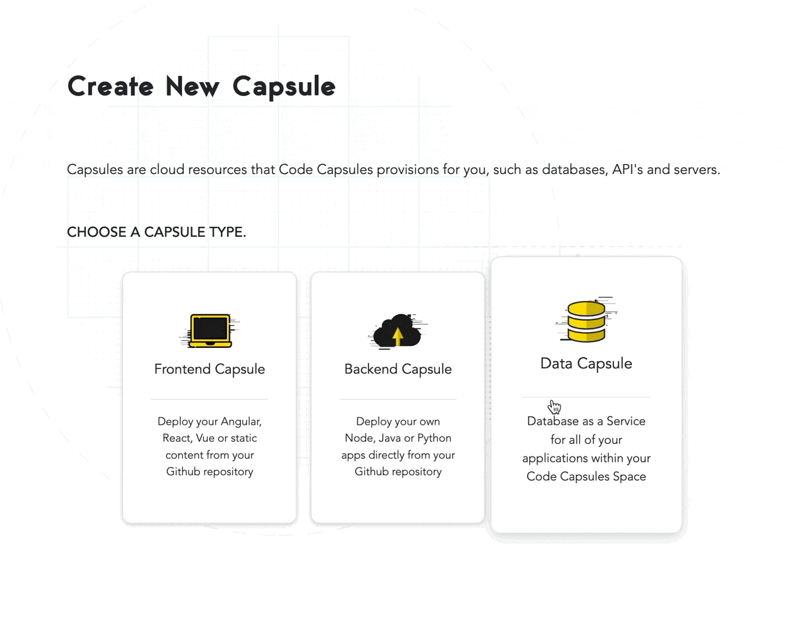
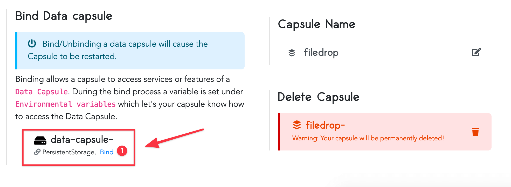
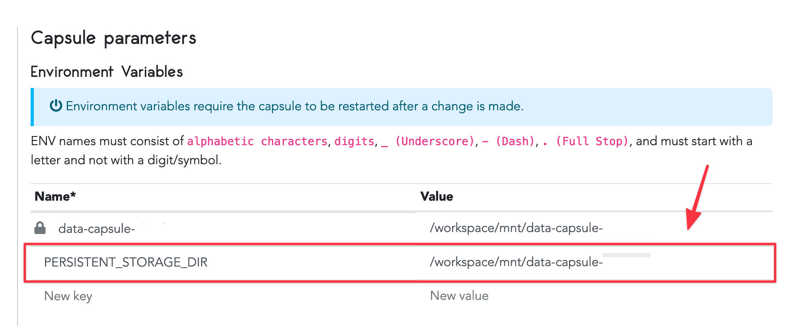
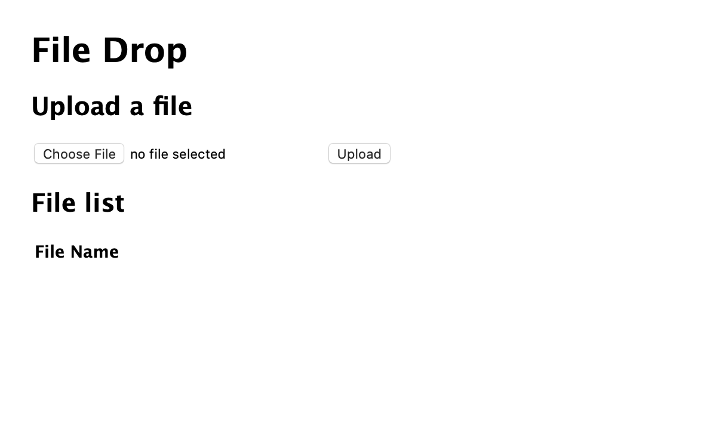
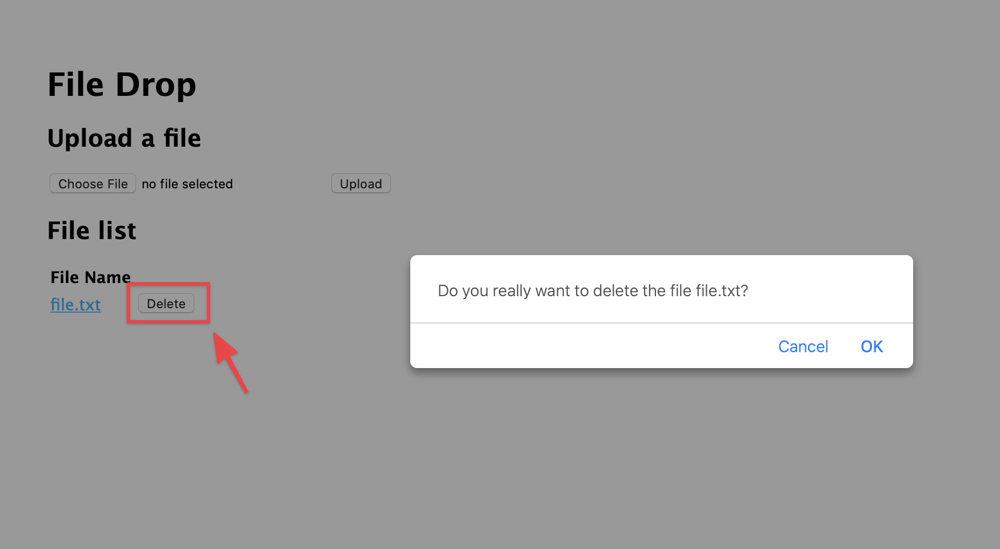

# Building a Web File Store

Having an online web drive, accessible to all your devices, anywhere is a very useful tool. This is the basis of services like Dropbox and Google Drive. 

Code Capsules has added a File System Data Capsule, which mounts as a standard file system to a Backend Capsule. This makes it very convenient to use for file storage, as opposed to using a blob store on other providers, as the file system interface is already well supported in most programming languages, and the concepts are already understood by programmers. 

In this tutorial, we'll use a [Backend Capsule](https://codecapsules.io) along with a file store Data Capsule to build a very simple web file store. We'll use [Node.js](https://nodejs.org/) as the programming language, and use [Express](http://expressjs.com) as the web framework. 

At the end of this tutorial, you'll have built a basic web interface to upload, download and delete files. You'll also secure it with a simple single user authentication scheme. 

## Overview and Requirements

You'll need the following service and software setup for this tutorial 

- [Git](https://git-scm.com) setup and installed, and a registered [GitHub account](https://github.com).
- [Node.js](https://nodejs.org/) installed
- A registered [Code Capsules](https://codecapsules.io) account.
- An IDE or text editor to create the project in. This tutorial was made using [Visual Studio Code](https://code.visualstudio.com), but feel free to use any tool you like. 

## Setting Up The Project

With our requirements in place, we can get started on setting them up to work as needed for our web file store project.

### Creating a New Repo 

We need a place to store our code from which [Code Capsules](https://code.visualstudio.com) can deploy to a capsule.

Head over to [GitHub](https://github.com), and create a new repo. We're calling it _filedrop_ here, but you can call it whatever you like. You can choose a **Node** `.gitignore` file to get started. Then clone the new GitHub repo onto your computer and navigate to that directory in terminal (or command prompt, if you're on Windows).

### Initialising the Base Project

We'll use the [Express.js](http://expressjs.com/en/starter/generator.html) generator to create the project base. [Express](http://expressjs.com) is a lightweight web framework for Node.js. To create the base project, type in the following: 

```bash
npx express-generator --hbs 
npm install
```

This creates a few files and folders that we can edit. The `--hbs` option tells the generator to use [Handlebars](https://handlebarsjs.com) as the HTML template language. We'll use Handlebars as it is very close to plain HTML, therefore making it easier to pick up quickly. 

The command `npm install` downloads and installs all the dependencies and packages required by the base project. Open the folder with [Visual Studio Code](https://code.visualstudio.com) or an editor of your choice, and browse through the files to get familiar. The `app.js` file in the project root is the main entry point for the app. 

Great, it's time to push this boilerplate project up to git. We can do it with the following from the command prompt or terminal: 

```bash
git add . 
git commit -am 'added base files for project'
git push origin
```

### Creating a new Backend Capsule 

We'll need a place to host our app. 

1. Log in to [Code Capsules](https://codecapsules.io), and create a Team and Space as necessary.
2. Link [Code Capsules](https://codecapsules.io) to the [GitHub account](https://github.com) repository created above. You can do this by clicking your username at the top right, and choosing _Edit Profile_. Now you can click the _Github_ button to link to a repo. 
3. Create a new Capsule, selecting the "Backend" capsule type.
4. Select the GitHub repository you create above. If you are only using the repo for this project, you can leave the _Repo Subpath_ field empty. You may need to add your repo to the team repo if you haven't already. Click the _Modify Team Repos_ to do so. 
5. Click _Next_, then on the following page, click _Create Capsule_. 


### Creating a new Data Capsule 

We'll need some data storage to store the files that are uploaded to the web drive. 

1. Create a new Capsule, selecting the "Data Capsule" type. 
1. Select "A persistent storage mounted directly to your capsule." as the Data Type. Choose a product size, and give it a name. 
1. Click "Create Capsule". 



### Link the Capsules

To use the Data Capsule with the Backend Capsule, we need to link them. Head over to the backend capsule you created above, and click on the "Configure" tab. Then scroll down to "Bind Data Capsule", and click "Bind" under the name of the data capsule you created. 



After binding the capsules, scroll up to the section "Capsule Parameters", you'll notice that an environment variable, `PERSISTENT_STORAGE_DIR`, with the mount point is automatically added. We'll use this environment variable in the code to access the storage drive. 



## Writing the Web Files Code

Now that we have all our systems setup, we can get onto the best part - coding!

### Getting the File List

Open up the file `index.js` in the `routes` folder in the project. This is the server code file for the default route `/` in the application. We'll use this route to show the file listing. 

To interact with the storage capsule and the files on it, we'll use the built in [`fs`](https://nodejs.org/api/fs.html#fs_file_system), or filesystem, module included in Node.js. Add a reference to this module at the top of the file:

```javascript
const fs = require('fs');
```

Then, modify the default `get` route to use the `fs` module to get the file listing on the storage drive. 

```javascript
router.get('/', function(req, res, next) {
  fs.readdir(process.env.PERSISTENT_STORAGE_DIR, function(err, files){
    if (err) return res.sendStatus(500); 
    files.sort(); 
    return res.render('index', {title: "File Drop", files: files}); 
  }); 
});
```

This code uses the [`readdir`](https://nodejs.org/api/fs.html#fs_fs_readdir_path_options_callback) function to get an array of all the files in the storage drive. Note that we use the environment variable which was automatically setup when we bound the capsules to specify the path to the storage drive. Environment variables are accessible through the [`process.env`](https://nodejs.org/api/process.html#process_process_env) object in Node.js.

The [`readdir`](https://nodejs.org/api/fs.html#fs_fs_readdir_path_options_callback)  function calls a callback function once it has the file list. The callback has 2 arguments: `err`, which will contain an error object if the folder could not be read, and `files`, which is a string array of all the filenames in the folder, if the call was successful. 

If the `err` object is populated, we immediately return with an [HTTP code `500`](https://en.wikipedia.org/wiki/List_of_HTTP_status_codes#5xx_server_errors) using the `sendStatus` function. The code `500` means that the server encountered an error processing a request, so the browser can show an error page. 

Since the [`readdir`](https://nodejs.org/api/fs.html#fs_fs_readdir_path_options_callback) function doesn't guarantee an order that the files are listed in, we use the built in [array `sort` function](https://developer.mozilla.org/en-US/docs/Web/JavaScript/Reference/Global_Objects/Array/sort) to sort the files alphabetically. By default, the sort function will sort alphabetically ascending - if you'd like a different sort order, you can supply a function to customise the behaviour. 

After the files are sorted, we can return the data to the browser. We call the [res.render](http://expressjs.com/en/4x/api.html#res.render) function, which takes in the name of the Handlebars template to use as the return web page. The templates are stored in the `views` folder of the project. The function also takes an object of data to be used by the [Handlebars](https://handlebarsjs.com) template to fill in values on the page. 

### Rendering the File List

Our backend route gets the file list, and passes it through to the `index` HTML template. Let's customise that template to display the files. Open up `index.hbs` in the views folder, and update the contents to this code:

```html
<h1>{{title}}</h1>

<div>
  <h2>File list</h2>
  <table>
    <tr>
      <th>File Name</th>
    </tr>
      {{#each files}}
      <tr>
        <td> 
            {{this}}
        </td>
      </tr>
      {{/each}}
  </table>
</div>
```

Handlebars uses the sequence `{{ }}` to indicate a section to template. In the first line, we template in `{{title}}`, which we specified in the return from the `GET / ` route we added earlier. 

Then, we set up a simple table, and use the [Handlebars each](https://handlebarsjs.com/guide/builtin-helpers.html#each) function to iterate over the elements in the `files` array we passed from the `Get / ` route. The Handlebars keyword `this` is used to refer to the current file name on each iteration. 

You can save, commit and push your changes so far. It should all automatically be deployed on [Code Capsules](https://codecapsules.io). After deploying, you can visit the public URL, and you should see something like this:


This is good, but a little uninteresting without any files to view!

### Adding the File Upload Route

Let's add functionality to upload a file, then we'll be able to view it in the list. We'll first add an [HTML upload form](https://www.w3schools.com/html/html_forms.asp) to the `index.hbs` file in the `views` folder. Add this code in, just under the `<h1>{{title}}</h1>` line: 

```html
<div>
  <h2>Upload a file</h2>
    <form ref='uploadForm' 
      id='uploadForm' 
      action='/' 
      method='post' 
      encType="multipart/form-data">
        <input type="file" name="newFile" />
        <input type='submit' value='Upload' />
    </form> 
</div>
```
This code adds in a new HTML form, which makes a `POST` request to the root `/` (our index page) on submit. We add in two inputs on the form - one, a file upload, specified by the `type="file"` attribute, and the other the submit button. Note the `name` given to the file input - we'll need to remember this when processing the upload on the server side. 

Now that we have a way for the user to select a file to upload and send to the server, we need to create a route to process the submitted file. In the `index.js` file in the  `routes` folder, we'll add a new HTTP route. This one will be a [POST](https://en.wikipedia.org/wiki/Hypertext_Transfer_Protocol#Request_methods) route, as we are using it to upload a new file (or resource) onto the server. Add this stub for the route in the `index.js` file: 

```js
router.post('/', function(req, res){

}); 
```
To handle file uploads with Express, we'll use a package that takes care of all the encoding and streaming concerns of file uploads. Open up the terminal and install the [`express-fileupload`](https://www.npmjs.com/package/express-fileupload) package using npm: 

```bash
npm install express-fileupload
```
To use this package, we need to add it into the [middleware](http://expressjs.com/en/guide/using-middleware.html) of our Express server. Open up the `app.js` file in the root folder of the project, and import the package by adding the following `require` statement at the top of the file:

```js
const fileUpload = require('express-fileupload');
```

Then, insert it into the Express middleware pipeline by adding the following line just under the `var app = express();` statement:

```js
app.use(fileUpload());
```

Adding in `express-fileupload` to the middleware will process any file upload and add an object `files` to the `req` object in our files. The `files` object contains any uploads in separate objects named the same as the HTML `inputs` on any form submitted to the route, along with methods to save the files to disk. 

Now we can expand on the route stub. In the `index.js` file, complete the  `POST` route as follows:

```js
router.post('/', function(req, res){
  
    if (!req.files || Object.keys(req.files).length === 0) {
      return res.status(400).send('No files were uploaded.');
    }
  
    const newFile = req.files.newFile;
    const uploadPath = process.env.PERSISTENT_STORAGE_DIR + '/' + newFile.name;
  
    newFile.mv(uploadPath, function(err) {
      if (err) return res.status(500).send(err);
      return res.redirect('/');
    });

});
```
First, we check if the  `files` object doesn't exist on the route, or if it does exist we check that there are no sub-objects on the list (i.e. no form `input` fields were populated). If this is the case, there is no file for the code to process, so we return early with a [HTTP status `400`](https://en.wikipedia.org/wiki/List_of_HTTP_status_codes#4xx_client_errors) code and a message to the user. Status code `400` means there is an input error from the user side. 


Otherwise, we can safely assume there is a file uploaded, so we get the file object by referencing the same name we gave to our HTML input field, on the `files` object that `express-fileupload` added to the `req` object. Now that we have the file object, we can construct a path to the data capsule's location to save the file, by using the environment variable for the data capsule mount point, along with the path separator `/` and the name of the uploaded file. You can see all the properties available on the file object at the [`express-fileupload` npm page](https://www.npmjs.com/package/express-fileupload). 


All we need to do now is to save the file to the upload path. `express-fileupload` provides a method `mv` on the file object to save the file to a disk location. It then calls a provided callback function when done, or if an error occurs. If we get a error back, we send an [HTTP code `500`](https://en.wikipedia.org/wiki/List_of_HTTP_status_codes#5xx_server_errors) back to the client, which means that there was an error on the server side. Otherwise, if all goes well, we redirect the client back to the index `/` page, which will call the `GET` route added earlier to refresh the file list on the client side.

This is a good point to commit the code to git, and test the new deployment on Code Capsules. After the capsule finishes rebuilding, navigate to the site. It should look something like this: 



The upload control may look slightly different depending on the web browser and operating system you use. Try choosing a file and uploading it - you should see it reflect in the browser now. 

### Downloading a File

We've got the functionality to upload files, and to list what is on the server. Now let's add functionality to download files. 

We'll add a route with the format `/filename` to get the requested file. We'll make use of the [`download`](http://expressjs.com/en/5x/api.html#res.download) functionality built into Express to send the file back to the browser. 

Add this route to the `index.js` file.

```js
router.get('/:filename', function(req, res, next){
    const filepath = process.env.PERSISTENT_STORAGE_DIR + '/' + req.params.filename; 
    return res.download(filepath); 
}); 

```
This sets up a `GET` route, with the requested filename as a parameter. Then the function constructs a path to the file,  using the environment variable for the data capsule mount point, along with the path separator `/` and the name of the requested file. 

Then we call the [`download`](http://expressjs.com/en/5x/api.html#res.download) method on the `res` (result) object with the constructed path. This sends the file back to the browser. 

Now we need a way to call this route from the front end. Open the `index.hbs` file in the `views` folder, and modify the `{{this}}` template in the file list table to an HTML [anchor `<a>` tag](https://www.w3schools.com/tags/tag_a.asp), with the `href` to the route we added above. We'll also add the [`download`](https://www.w3schools.com/tags/att_a_download.asp) attribute to the tag. This means that the link will not be opened in the browser, but rather downloaded. The updated file list table should look like this now: 

```html
<div>
  <h2>File list</h2>
  <table>
    <tr>
      <th>File Name</th>
    </tr>
      {{#each files}}
      <tr>
        <td> 
            <a href='/{{this}}' download>{{this}}</a> 
        </td>
      </tr>
      {{/each}}
  </table>
</div>
```

Commit these changes, and wait for Code Capsules to redeploy the site. If you navigate to the site now, you should see the file you uploaded earlier as a hyperlink now. Clicking on the link should download the file. 


### Deleting a File

We can upload and download now. We'll probably also need to remove, or delete, files at some point as well, if we need to free up space, or just clean up old files. We can use the HTTP [`DELETE` verb](https://en.wikipedia.org/wiki/Hypertext_Transfer_Protocol#Request_methods) on a route for this. 

Since the data capsule appears just like a regular filesystem to our code, we can use the built-in Node.js [`fs`](https://nodejs.org/api/fs.html#fs_file_system) module here again. It has a method called [`unlink`](https://nodejs.org/api/fs.html#fs_fs_unlinksync_path) which deletes a file from a filesystem. We supply it with a path to the file, and a callback function which let's us know the result of deleting the file. This could be either a success, or an error. If we get an error, we'll send an [HTTP code `500`](https://en.wikipedia.org/wiki/List_of_HTTP_status_codes#5xx_server_errors) status back to the browser, to let the browser know that an error occurred. If the delete action is successful, we'll send a status code [`200`](https://en.wikipedia.org/wiki/List_of_HTTP_status_codes#2xx_success), which lets the browser know that the operation was a success. Add this route to the `index.js` file to implement the `DELETE` route: 

```js
router.delete('/:filename', function(req, res){
  const filepath = process.env.PERSISTENT_STORAGE_DIR + '/' + req.params.filename; 

  fs.unlink(filepath, function (err) {
    if (err) return res.sendStatus(500); 
    else return res.sendStatus(200); 
  }); 

}); 
```

Now, let's update the front end to be able to call this route. Open the `index.hbs` file, and add a new header column to the file table, along with a button for each file in the new column to delete it. 

```html
<div>
  <h2>File list</h2>
  <table>
    <tr>
      <th>File Name</th>
      <th></th>
    </tr>
      {{#each files}}
      <tr>
        <td> 
            <a href='/{{this}}' target="_blank">{{this}}</a> 
        </td>
        <td>
          <button>Delete</button>
        </td>
      </tr>
      {{/each}}
  </table>
</div>

```

Now let's create some front end javascript code for the button to call when clicked. We'll use the browser side [`fetch`](https://developer.mozilla.org/en-US/docs/Web/API/Fetch_API) function to call the `DELETE` file route. Add this script block at the bottom of the `index.hbs` file: 

```js
<script type="text/javascript">
  function deleteFile(filename){

    var confirmation = confirm('Do you really want to delete the file ' + filename + '?'); 
    if (confirmation === true){
      fetch('/' + filename, { method: 'DELETE' })
      .then(response => location.reload())
      .catch(error => alert('Error deleting the file! ' + error)); 
    }
  }
</script>
```

This adds a new function `deleteFile` to the front end index page. It has one argument - the name of the file to delete. First, we make use of the built in [`confirm`](https://developer.mozilla.org/en-US/docs/Web/API/Window/confirm) function which exists in all browsers. This brings up a dialog box with our message _Do you really want to delete the file?_, just to make sure the user didn't accidentally click the delete button. If the user clicks "Yes", the dialog box returns a `true` value. Then we call our `DELETE` route using [`fetch`](https://developer.mozilla.org/en-US/docs/Web/API/Fetch_API). We need to pass in the route to call, and we also send an [init](https://developer.mozilla.org/en-US/docs/Web/API/WindowOrWorkerGlobalScope/fetch#parameters) object which specifies that the `DELETE` HTTP verb must be used to call this route. 

The [`fetch`](https://developer.mozilla.org/en-US/docs/Web/API/Fetch_API) function returns a `promise`. This is an alternative to callbacks. If the call was successful, the code in the `.then()` handler is called. This reloads the page, so that the file listing is updated to show that the file is now deleted. If the call fails, the code in the `catch` handler is called. This uses another standard browser dialog, an [`alert`](https://developer.mozilla.org/en-US/docs/Web/API/Window/alert), to let the user know that something went wrong. 

Now let's hook this function up to the button we added for each file. We'll use the [`onclick`](https://www.w3schools.com/jsref/event_onclick.asp) event on the buttons to call the function, along with the filename to be deleted. Update the button code like this: 

```html
<button onclick="deleteFile('{{this}}')">Delete</button>
```

Commit these changes, and wait for Code Capsules to redeploy the site. Then navigate to the site and try out the "Delete" button next to the filename.



### Adding Authentication

We've created the basic functions of a web drive. However, anyone can get to the site and upload, download or delete documents. We need a way to control access. For this tutorial, we'll implement a very simple access control system, that only allows access to one pre-defined user. To do this, we'll use as the basis of the system the [`Passport` node package](http://www.passportjs.org). This is a modular package, which is great because it allows for very simple authentication schemes to very elaborate ones, meaning you can upgrade the security of this app as you need. 

The basic scheme we'll use is a simple username and password combination, entered on an HTML form that is posted to a `login` route. Once authenticated with these 2 pieces of information, we'll set a [session cookie](https://en.wikipedia.org/wiki/HTTP_cookie) to remember the logged-in user while using the site. We'll use the package [`express-session`](https://www.npmjs.com/package/express-session) to manage the session. 

Passport has a plugin called [`Local Strategy`](https://www.npmjs.com/package/passport-local) to achieve the username and password scheme.  

Let's start by installing all these packages and plugins. Type the following at the terminal:

```bash
npm install passport passport-local express-session
```

Now, add references to these packages to the top section of the `app.js` file. A good place to add them is after the `var logger = require('morgan');` line.

```js
var passport = require('passport'); 
var LocalStrategy = require('passport-local').Strategy;
var session = require("express-session");
```

The first thing to add to the app is the session middleware, then the passport auth middleware. Add the following after the `app.use(express.static(path.join(__dirname, 'public')));` line: 

```js
app.use(session({secret : "<YOUR_SECRET>"})); 
app.use(passport.initialize());
app.use(passport.session());

```
This inserts the `session` middleware into the app pipeline, to read and write persistent sessions to app cookie. Replace the `<YOUR_SECRET>` parameter with a string of your choosing. This secret is used to sign the session information that is placed in the cookie. Normally, this is kept very secret, as anyone who has access to the secret could construct a session cookie that looks legitimate to the server, which would give them access to any account on the server. You can also add an environment variable to store this secret, rather than store it in the code repo. 

Then, we initialize passport into the middleware pipeline, as well as adding in the code for Passport to use Sessions to check and record authentication. 

When using sessions with Passport, we need to implement serialisation and deserialisation of user objects from session information, so that Passport can add the user object to the `req` object in the app pipeline. Add these functions to the bottom of the `app.js` file: 

```js
passport.serializeUser(function(user, done) {
  process.nextTick(function(){
    done(null, user);
  }); 
});

passport.deserializeUser(function(user, done) { 
  process.nextTick(function(){
    done(null, user);
  }); 
});
```
In our case, since we are implementing a super simple auth scheme with just one user, we don't need to call out to a database or other store to get user information. In fact, since there is no real user information that is of use to our app at the moment, we just return the `user` object that passport sends to us straight back, as we don't really have a use for it. Even though we are doing nothing with the information, we need to register these functions with Passport, as it calls them regardless. 

Now we can set up the rest of the logic for Passport. Add this code just above the serialisation code: 

```js
passport.use(new LocalStrategy(
  function(username, password, done) {
    if (username === process.env.USERNAME && password === process.env.PASSWORD){
      return done(null, {username: process.env.USERNAME }); 
    }
    else {
      return done(null, false, {message: "Incorrect username or password"}); 
    }
  })
);

```

This plugs in and registers the Local Strategy module into Passport. The local strategy means we'll be using a simple username and password, checked on the local server. There are many other [strategies available](http://www.passportjs.org/packages/) for Passport, from oAuth2.0 strategies which allow authentication through Facebook, Google, Twitter and other oAuth2.0 providers, and to API authentication strategies such as Bearer Tokens etc. 

The local strategy requires a function which accepts a username and password for validation. The function needs to check if these credentials are valid, and send back a user object if they are, through the `done` callback. If the credentials don't checkout, we send back an error message. 

In this function, we simply check against a username and password stored in our environment variables. If the credentials to be checked match the credentials in our environment variables, we authenticate the user. 

Head over to the "Configure" tab on your backend Code Capsule, and add 2 new environment variables : `USERNAME` and `PASSWORD`. Supply values of your own to set your username and password, then click the "Update Capsule" button to save the changes. 


**Note:** _While this method of storing user credentials is appropriate for a small single user hobby project, it is not sufficient for production with customer credentials. Look to implementing a more robust user store, with password hashing and salting, or using a 3rd party authentication service such as a social network or an oAuth provider_

Now we can add the login page routes to render the login page, and also to handle the form post with user credentials from the page, through to Passport. 

Add these 2 routes just above the index routes (`app.use('/', indexRouter);`) in `app.js`: 

```js
app.get('/login', function(req,res){
	return res.render('login')
}); 
app.post('/login',
  passport.authenticate('local', { successRedirect: '/', failureRedirect: '/login' }));
```

The first `GET` route adds a `/login` url to our app. The route handler function calls the [`res.render`](http://expressjs.com/en/4x/api.html#res.render) Express method to serve up the login template, which we'll add shortly. The second `POST` route handles a form submission from the `/login` route, and passes it through to Passport. We supply a parameter to tell Passport to use our Local Strategy to process this authentication request, and also supply redirects for the cases of both successful (send to the main file list page), or unsuccessful (failure, send back to login to try again).

There's one more bit of code to add before we add the login front end form. We need to check if a user was successfully authenticated before they can access the file list and other functionality. To do this, we'll insert a call to an auth check function in our app middleware. Add this code just above the `app.use('/', indexRouter);` line, so it is called before any of those routes are served: 

```js
app.use(isAuthenticated); 
```

Now, let's implement the reference `isAuthenticated` middleware. Add this function to the bottom of the `app.js` file: 

```js
function isAuthenticated(req, res, next) {
  if (req.isAuthenticated())
    return next();
  else 
  	return res.redirect('/login');
}
```

If a user is successfully authenticated, the `isAuthenticated()` method, which is added by Passport to the `req` object, will return `true`. In that case, we can safely let the pipeline proceed to the next middleware function (in this case, one of the protected routes.). If the authentication check comes back `false`, we redirect back to the login page, away from our protected pages. 

Great, now we have all the back end pieces for authentication in place. Let's add the login page and form. Add a new file called `login.hbs` under the `views` folder. Place this code into the new file: 

```html
<form action="/login" method="post">
    <div>
        <label>Username:</label>
        <input type="text" name="username"/>
    </div>
    <div>
        <label>Password:</label>
        <input type="password" name="password"/>
    </div>
    <div>
        <input type="submit" value="Log In"/>
    </div>
</form>
```
This adds a very simple form, which makes a `POST` request back to our `/login` route, with inputs for a username and password. 

We are done with authentication. Once again, commit these changes, and wait for Code Capsules to redeploy the site. Then navigate over and test it out. This time, the site should prompt for your username and password (which you added to the environment variables) before letting you through to the files page. 


Congratulations, you have completed building a personal web drive using [Code Capsules](https://codecapsules.io) and [Node.js](https://nodejs.org/)!


## Next Steps

While this project has some decent basic functionality, there are many things that could be added to upgrade it, such as: 

- Adding some styling to make it look better
- Add support for sub-folders
- Add support for multi-file upload
- Add logout functionality, using the [Passport logout function](http://www.passportjs.org/docs/logout/)
- Add better authentication, and perhaps separate user accounts for a multi-user drive.


