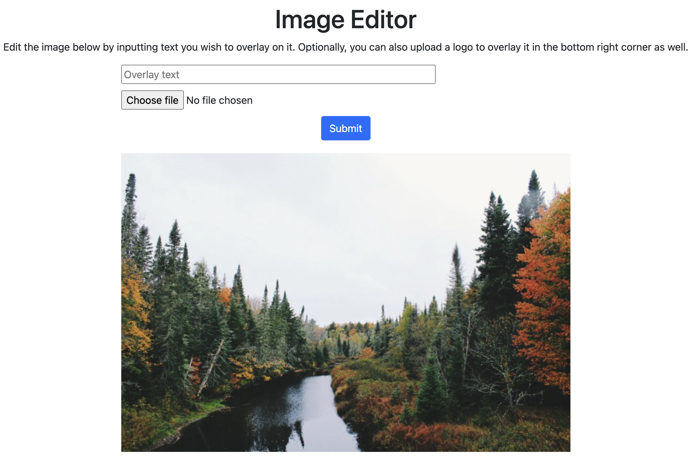
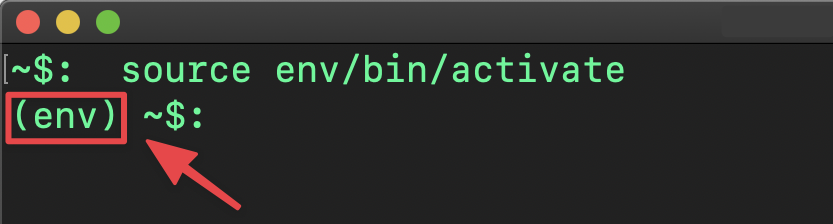

# Building an Image Editing Tool

Image editing is an important skill to have if you intend to have any sort of online presence for yourself or brand. In this tutorial, we’ll look at how to perform simple image edits in Python using the Pillow library.

At the end of the tutorial, you will be able to overlay images with any text or smaller picture (ideally a logo) using your own program. See the image below to get an idea of what the application will look like once you’re done.



## Overview and Requirements

We are going to deploy the application on Code Capsules so that you can showcase it to the world and also have access to it even when you’re not on your PC. To do that, you will need the following:

- A [Code Capsules](https://codecapsules.io) account
- Python 3 installed
- An IDE or text editor of your choice
- Git set up and installed, and a registered [GitHub](https://github.com) account

## Setting Up the Project

Check that you have all the requirements in place then proceed with the tutorial. We will start by creating the project folder then set up a virtual environment within that folder.

### Create Project Folder

Let’s create the folder that will house our application’s source code. Run the commands below in the terminal to create the folder and navigate into it.

```
mkdir text-image-overlay
cd text-image-overlay
```

From here onwards, the `text-image-overlay` directory will be referred to as the project’s root folder.

### Create a Virtual Environment

A virtual environment allows you to isolate the packages required to develop Python applications from your computer system. We recommend you use a new virtual environment for every application you develop so as to not corrupt dependencies for other applications.

In the terminal run the following command to create a virtual environment within the project's root folder:

```
python -m venv env
```

To activate the virtual environment, enter either of the following:

**MacOS**

```
source env/bin/activate
```

**Windows**

```
.\env\Scripts\activate
```

After activating the virtual environment, the name `env` should appear in brackets on the leftmost part of your terminal in your current line. This signals that the activation was successful.



### Installing Dependencies

We can now install our required packages to the virtual environment we activated in the previous step. Run the command below:

```
pip install flask pillow gunicorn rq
```

### Initialize an Empty Git Repository

While in the project’s root folder, enter the command `git init` to initialize a `git` repository. This will allow you to track changes to your app as you build it.

Create a `.gitignore` file and add the line below to it:

```
/env
```

This excludes the env folder from being tracked by Git, as we only want to track changes in our project files.

### Linking to GitHub

Head over to [GitHub](https://github.com/) and create a new repository. Then, in your project's root folder, run the command below from the terminal, replacing `username` and `repository_name` with your own values from GitHub.

```
git remote add origin git@github.com:username/repository_name.git
```

This will link your local repository to the one on GitHub.

## Building the Frontend

We can now begin building our app after completing the set up phase. Let’s start by building the frontend which will be a flask jinja template. To do this you need to create an `app/templates` folder inside the project’s root folder.

Next, create an `index.html` file inside the `templates` folder, and populate it with the code below:

```html
<!DOCTYPE html>
<html lang="en">
  <head>
    <title>Image Text Overlay App</title>
    <link
      href="https://cdn.jsdelivr.net/npm/bootstrap@5.0.0-beta1/dist/css/bootstrap.min.css"
      rel="stylesheet"
      integrity="sha384-giJF6kkoqNQ00vy+HMDP7azOuL0xtbfIcaT9wjKHr8RbDVddVHyTfAAsrekwKmP1"
      crossorigin="anonymous"
    />
    <style>
      body {
        padding: 20px;
        text-align: center;
      }
      form {
        width: 50%;
        margin: auto;
        margin-bottom: 20px;
      }
      input {
        width: 70%;
        display: block;
        margin-bottom: 10px;
      }
    </style>
  </head>
</html>
```

The `head` section of an `html` page contains metadata about the page such as its title and links to any scripts it uses. We have linked to Bootstrap 5 to allow us to use its pre-styled elements by adding the relevant class names to them. This enables us to focus on building out our app’s functionality and not the styling. The few styling lines we have to add are placed between the `style` tags but for a larger project we recommend you use a separate `css` file to house your styles.

Next, let’s add code that will be rendered in the body tag of our page. Copy and paste the code below underneath the closing `</head>` tag:

```html
<body>
    <h1>Image Editor</h1>
    <p>Edit the image below by inputting text you wish to overlay on it. Optionally, you can also upload a logo to overlay it in the bottom right corner as well.</p>

    <form action="{{ url_for('handle_submit')}}" method="post" enctype=multipart/form-data>
        <input type="text" name="overlay_text" placeholder="Overlay text" />
        <input type="file" name="logo" />
        <button type="submit" class="btn btn-primary">Submit</button>
    </form>

    
</body>
```

Inside our page’s body we have a form that will accept the text and logo image a user will want to overlay on the background image. When a user clicks the submit button the `form action` gets triggered which posts the form data to the `handle_submit` route. We will see how this route processes this data shortly when we build the backend.

Underneath the form, there is an `img` tag responsible for rendering the background image that will be edited. The image is located in the `app/static` folder and we reference it using the `url_for` attribute. Download the background image used for this tutorial [here](https://github.com/codecapsules-io/image-text-overlay/blob/main/app/static/fall-season.jpeg) and paste it in the `app/static` folder. You can use any image you want as the background so long as you replace the filename with the name of the image that you’ve decided to use.

## Building the Editing Backend

With the frontend now complete, we can start building the backend responsible for performing the edits. Start by creating a `run.py` file in the project’s root folder and populate it with the code below:

```py
from app import app

if __name__ == "__main__":
    app.run()
```

This is the point of entry for any server wishing to run our app.

### Declare and Initialize `app` Module

Create an `__init__.py` file in the app folder and populate it with the code below:

```py
from flask import Flask

app = Flask(__name__)

from app import views
```

Here we declare our app object using the Flask package we installed earlier.

### Create Views

The next step is to create our application’s views. For this you will need to create a `views.py` file inside the `app` folder and add the following code to it:

```py
from app import app
import os
from flask import render_template, request, send_file
from PIL import Image, ImageFont, ImageDraw

@app.route("/", methods=["GET"])
def index():
    return render_template("index.html")
```

The code above imports the necessary modules we’ll need for our views logic and defines an index route `/` which renders the `index.html` template we added earlier.

Copy and paste the code below for the `handle_submit` route at the bottom of the `views.py` file.

```py
@app.route('/handle_submit', methods=['POST'])
def handle_submit():
    overlay_text = request.form['overlay_text']
    title_font = ImageFont.truetype('PlayfairDisplay-Black.ttf', 20)

    my_image = Image.open("fall-season.jpeg")
    width, height = my_image.width, my_image.height

    image_editable = ImageDraw.Draw(my_image)
    x, y = (width - 510, height-400)

    if len(overlay_text) > 25:
        string_center_index = len(overlay_text) / 2
        overlay_text = overlay_text[:int(string_center_index)] + "\n" + overlay_text[int(string_center_index):]

        w, h = title_font.getsize(overlay_text[:int(string_center_index)])
        image_editable.rectangle((x, y, x + w, y + 2*h), fill='black')
    else:
        w, h = title_font.getsize(overlay_text)
        image_editable.rectangle((x, y, x + w, y + h), fill='black')

    image_editable.text((x,y), overlay_text, (247, 250, 251), font=title_font)

    if request.files:
        logo = request.files['logo']
        logo = Image.open(logo)
        logo_width, logo_height = logo.size
        logo = logo.convert("RGBA")
        my_image.paste(logo, (width - logo_width, height - logo_height))

    my_image.save("result.jpg")
    return send_file("../result.jpg", mimetype='image/jpg', as_attachment=True, download_name="result.jpg")
```

Next, paste the background image in the project’s root folder. You can download it [here](https://github.com/codecapsules-io/image-text-overlay/blob/main/app/static/fall-season.jpeg). You will also need a true type font file of your favourite font style or alternatively use the [Playfair Display](https://github.com/codecapsules-io/image-text-overlay/blob/main/PlayfairDisplay-Black.ttf) font which is the one used for the purposes of writing this tutorial. Paste the font file in the project’s root folder and if you’ve used a different font file make sure to replace the font file name in the line, `title_font = ImageFont.truetype('PlayfairDisplay-Black.ttf', 20)` with the name of your font file.

The `handle_submit` route is responsible for editing the background image by overlaying it with the text and logo supplied by the user. In order to do so, we make use of the Pillow package which makes image manipulation easier. After opening the background image we convert it to an `ImageDraw` object which can be edited.

In addition to overlaying the image with text, we are also going to apply a black background to the text so that it’s always visible or readable against the background image. We do this by first getting the dimensions (width and height) of the text using the `getsize()` method of the `ImageFont` class. The black background will have the same dimensions as the text and we draw it using the `rectangle()` method of the `ImageDraw.Draw` class.

When the text is long we are going to split it into two lines and write one on top of the other so that it doesn’t “spill” over the background image. The first `if-else` block checks to see whether the user supplied a long string or not. If the string is longer than 25 characters then we split it. When the text occupies two lines the black background is twice the height of the font to allow for the second line to have a black background as well.

After the text background has been applied, the line `image_editable.text((x,y), overlay_text, (247, 250, 251), font=title_font)` will add the text on top of the background. Now, the only thing left to do is check whether the user uploaded a logo as well. If a logo was uploaded, then `request.files` will evaluate to true and the logic in the last `if` block will be executed.

Inside the last `if` block we get the dimensions of the logo image so that we’ll be able to place it in the bottom right corner of the background image. We first convert it to an “RGBA” image then pass it as an argument to the `paste()` method. If the user did not supply a logo then `request.files` will be false and the last `if` block won’t execute.

The last step in the editing logic is to save the newly edited image and return it as an attachment which downloads it to the user’s PC.

## Prepare for Deployment

Our app is now complete and we are only left with adding the files necessary for deployment before we can publish it.

### Add a Procfile and `requirements.txt`

We’ll start by creating a Procfile, which tells Code Capsules how to run our app. Create a file named Procfile in the project root folder and add the following code to it:

```
web: gunicorn run:app
```

We use the gunicorn server to run our app in production, since the built-in Flask server is less secure and only suitable to be used in a development environment.

Next, we need to generate a requirements.txt file to tell Code Capsules which packages need to be installed first before our app can start. Run the command below from a terminal while in the project’s root folder to create a requirements.txt file.

```
pip freeze –local > requirements.txt
```

### Add, Commit and Push Git Changes

Let's add and commit all the files we created to our local repository and then push them to the remote one. Do this by running the commands listed below in a terminal while in the project’s root folder:

```
git add -A
git commit -m "Added image editing files"
git push -u origin main
```

Your remote repository will now be up to date with your local one.

## Deploy to Code Capsules

The final step is to deploy our app. Log into your Code Capsules account and link your remote GitHub repository to Code Capsules. Create a Backend Capsule and deploy the app there. You can follow this [deployment guide](https://codecapsules.io/docs/deployment/how-to-deploy-flask-application-to-production/) to see how to do this in greater detail.

That’s it! Your "Image Editing" app should be live and fully functional now.
