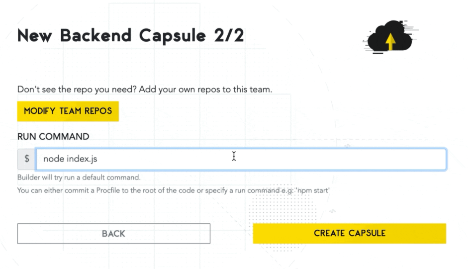
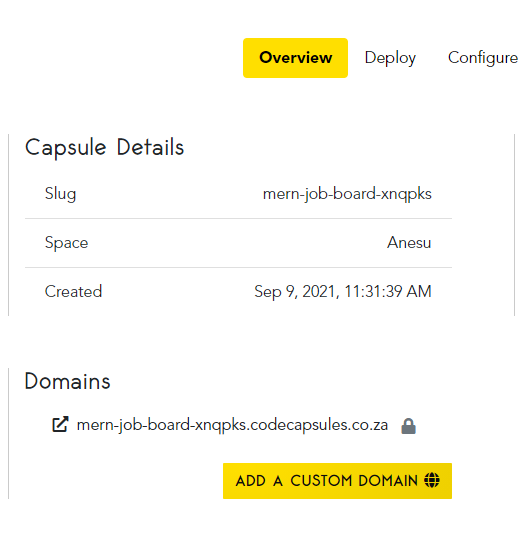

# Build a MERN job board

Applications built using the MERN (MongoDB, Express, React, Node) stack have the convenience of needing only one capsule to host both the frontend and backend.

In this tutorial, we’ll look at how to extend a boilerplate MERN application in order to make a job board based on the same architecture. When complete, the job board will be a platform where users can view and submit available jobs. 

First, clone [this repository](https://github.com/codecapsules-io/mern-stack) with the boilerplate MERN application to your desired working directory. 

## Extending the Front End

We’ll start by extending the front end to show that it’s for a job board. After successfully cloning the repo mentioned above, open the project’s root folder and navigate to the client directory. Inside this folder, you will find the `src` code for the react front end we want to extend. Open the command line and run `npm install` whilst in the client directory to install the project’s node_modules. 

When you’ve installed the node_modules you can now start the react side of the app to see how it looks by running `npm start`. After running this command you should see a page similar to the one shown below in your default browser at port 3000. 


We need to change this front end to reflect the job board functionality.

### Adding the SubmitJob Component

Create a `client/src/components` folder to house the view and submit job components we’re going to build next. Inside the components folder, create a `submitJob.js` file with the following code in it to allow users to submit jobs.  

```js
import React, {useState} from 'react'
import axios from 'axios'

const SubmitJob = () => {

    const [jobTitle, setJobTitle] = useState("")
    const [jobDescription, setJobDescription] = useState("")
    const [jobLocation, setJobLocation] = useState("")
    const [jobSalary, setJobSalary] = useState(null)

    const postJob = (e) => {
        const data = { title: jobTitle, description: jobDescription, location: jobLocation,
                        salary: jobSalary }
        axios.post('http://localhost:8080/', data)
        .then(response => {
          console.log(response)
        })
    }

    return(
        <div className="submitJobContainer">
            <h3>Submit a Job</h3>
            <form className="formContainer" onSubmit={postJob}>
                <input type="text" name="title" placeholder="Job Title" 
                  onChange={e => setJobTitle(e.target.value)} />
                <input type="text" name="description" placeholder="Job Description"
                    onChange={e => setJobDescription(e.target.value)} />
                <input type="text" name="location" placeholder="Job Location"
                    onChange={e => setJobLocation(e.target.value)} />
                <input type="number" name="salary" placeholder="Job Salary"
                    onChange={e => setJobSalary(e.target.value)} />
                <button className="submitButton" type="submit">Submit</button>
            </form>
        </div>
    )
}

export default SubmitJob
```

The SubmitJob component uses state to keep track of the job field values as they are entered by a user. You can add more state variables if you wish to capture more job fields in your application. When the user clicks submit the postJob method posts the job field values to the endpoint specified in the `axios.post()` method. Remember to change the localhost url to an actual remote url when you deploy. 

### Adding the ViewJob Component

Create a `viewJobs.js` file in the components folder and put the below code in it. 

```js
import React, {useState, useEffect} from 'react'
import axios from 'axios'

const ViewJobs = () => {

    const [jobsStateArray, setJobsStateArray] = useState([])

    useEffect(() => {          
        axios.get('http://localhost:8080/')
        .then(response => {
            console.log(response)
            setJobsStateArray(response.data)
          })
    }, [])

    return(
        <div className="viewJobsContainer">
            <h3>View Available Jobs</h3>
            {jobsStateArray.map((item, index) => {
                return(
                    <div className="jobCard">
                        <p><strong>Job Title</strong>: {item.title}</p>
                        <p><strong>Location</strong>: {item.location}</p>
                        <p><strong>Description</strong>: {item.description}</p>
                        <p><strong>Salary</strong>: {item.salary}</p>
                    </div>
                )
            })}
        </div>
    )
}

export default ViewJobs
```

The ViewJobs component uses hooks to fetch available jobs as soon as the page loads. After fetching the jobs, they are stored in the jobsStateArray before being displayed using the `map` function.  

### View the Front End 

We need to add the two components we just created to `src/App.js` before we can see the changes we just made. Open `App.js` and replace its contents with the code below. 

```js
import logo from './logo.svg';
import './App.css';
import React, {useState} from 'react';
import axios from 'axios';
import SubmitJob from './components/submitJob/submitJob';
import ViewJobs from './components/viewJobs/viewJobs';

function App() {
  return (
    <div className="App">
      <header className="App-header">
        
        <h3>Job Board</h3>
      </header>
      <SubmitJob />
      <ViewJobs />
    </div>
  );
}

export default App;
```

React displays the contents of `App.js` and the code we added imports the components we made so that they can be rendered. Open your browser to see how the front end looks now. The page layout should’ve changed but the styling is a bit off. Add the contents of [this css file](https://github.com/ritza-co/mern-job-board/blob/main/client/src/App.css) to `src/App.css` in order to make our front end prettier. 

When you’ve added the above mentioned css your application should now look like this. 


We’re now ready to extend the back end.

## Extending the Back End

### Create and Connect to a MongoDB Data Capsule

Connecting to a data capsule allows your application to save jobs persistently across different sessions. Create a MongoDB data capsule and copy its url value which we’ll use to connect to it. If you are unsure about how to do this, refer to [this article](https://codecapsules.io/docs/reference/set-up-mongodb-data-capsule/) for help.  

As environment variables are only available in a backend capsule replace `process.env.DATABASE_URL` in `app/config/db-config.js` with the url you copied above whilst developing locally. After this, your application can now successfully read and write to your database.   

### Adding Job model

Next, let’s define our job model to declare which job fields we want to save. Open `app/models/index.js` and replace its contents with the code below.

```js
const dbConfig = require("../config/db-config.js");

const mongoose = require("mongoose");
mongoose.Promise = global.Promise;

const db = {};
db.mongoose = mongoose;
db.url = dbConfig.url;
db.jobs = require("./job.model.js")(mongoose);

module.exports = db;
```

In the code above we create and export a db variable that we will use to access the database. We will also be using the mongoose interface to handle all communication with our MongoDB. 

Create a file named `job.model.js` in the models folder to define the fields and field types of the job model. Populate it with the code below and if you added more fields to your front end SubmitJob component remember to add them here as well or they won’t be saved when a user submits a job.

```js
module.exports = mongoose => {
var schema = mongoose.Schema(
    {
    title: String,
    description: String,
    location: String,
    salary: Number
    },
    { timestamps: true }
);

schema.method("toJSON", function() {
    const { __v, _id, ...object } = this.toObject();
    object.id = _id;
    return object;
});

const Job = mongoose.model("job", schema);
return Job;
};
```

By default, mongoose names object id fields `_id` and the `schema.method()` function makes sure the name of the id field is just `id` which is the name our front end expects. Delete the `person.model.js` file that came with the boilerplate project as we won’t be needing it. 

### Adding Job controllers

After defining the job model the next step is to create controllers which decide whether the app will be reading or writing jobs to the database. Inside the `app/controllers/` folder create a file named `job.controller.js` with the following code in it. 

```js
const db = require("../models");
const Job = db.jobs;

// Create and Save a new Job
exports.create = (req, res) => {
  // Validate request
  if (!req.body.title) {
    res.status(400).send({ message: "Content can not be empty!" });
    return;
  }

  // Create a Job
  const job = new Job({
    title: req.body.title,
    description: req.body.description,
    location: req.body.location,
    salary: req.body.salary
  });

  // Save Job in the database
  job
    .save(job)
    .then(data => {
      res.send(data);
    })
    .catch(err => {
      res.status(500).send({
        message:
          err.message || "Some error occurred while creating the Job."
      });
    });
};

// Retrieve all Jobs from the database.
exports.findAll = (req, res) => {
    const title = req.query.title;
    var condition = title ? { title: { $regex: new RegExp(title), $options: "i" } } : {};
  
    Job.find(condition)
      .then(data => {
        res.send(data);
      })
      .catch(err => {
        res.status(500).send({
          message:
            err.message || "Some error occurred while retrieving Jobs."
        });
      });
};
```

The `create` export is responsible for creating a new job object using the job model and saving it to the database. The `findAll` export retrieves all jobs that were previously submitted. Delete the `person.controller.js` file that came with the boilerplate project as we won’t be needing it. 

### Adding Endpoints

The last step in extending the back end is to add endpoints where the front end will be making post and get requests to. Create a `job.routes.js` file in the `app/routes/` folder and add the below code to it. 

```js
module.exports = app => {
    const jobs = require("../controllers/job.controller.js");
  
    var router = require("express").Router();
  
    // Create a new Job
    router.post("/", jobs.create);
  
    // Retrieve all Jobs
    router.get("/", jobs.findAll);
  
    app.use('/api/jobs', router);
};
```

The routes use request methods and the controller exports we made earlier to decide what happens when each endpoint is hit by a get or post request. Delete the `person.routes.js` file that was in the routes folder and modify the line below in index.js in the root folder of the project.

From 

```js
require("./app/routes/person.routes")(app);
```

Change to 

```js
require("./app/routes/job.routes")(app);
```

The line above tells our back end to use the routes defined in `job.routes.js`.

## Integrating the Front and Back End 

Before deploying a mern application you need to build the front end to optimize it for production and in our case to also update the contents in the `client/build` folder with the new frontend for the job board. Navigate to the client folder in the command terminal and run `npm run build` to build the job board front end. 

Our express backend uses the contents inside the `client/build` folder to render the frontend of the mern application. The lines below in index.js in the root folder handle that responsibility.

```js
const path = __dirname + '/client/build/';
const app = express();
app.use(express.static(path));
```

## Deploying to Code Capsules

Our job board is now ready to be deployed. To do that, push the job board code to your github repository and create a backend capsule on Code Capsules to house the job board. Link the back end capsule with the repository containing your job board application and in the run command field enter `node index.js` as shown below to tell Code Capsules how to run your application. 



When you’ve deployed your application, navigate to the “Overview” tab of your capsule and scroll down to the “Domains” section in the bottom left and copy the url of your application. 



Paste this url in `client/src/components/submitJob.js` and `client/src/components/viewJobs.js` in place of the localhost link we were using during the development phase. The `useEffect()` hook in `viewJobs.js` should now be similar to this:

```js
useEffect(() => {          
        axios.get('https://<your-capsule-url-here>/api/jobs/')
        .then(response => {
            console.log(response)
            setJobsStateArray(response.data)
          })
    }, [])
```

And the `postJob()` method in `submitJob.js` should look like this:

```js
const postJob = (e) => {
        const data = { title: jobTitle, description: jobDescription, location: jobLocation,
                        salary: jobSalary }
        axios.post('https://<your-capsule-url-here>/api/jobs/', data)
        .then(response => {
          console.log(response)
        })
    }
```

Run `npm run build` in the client folder to rebuild your front end and push your updates to your repository. Code Capsules will automatically deploy the new version of your job board as soon as it detects a push on the main branch of your repository. 

That’s it, your job board should be fully functional now.
