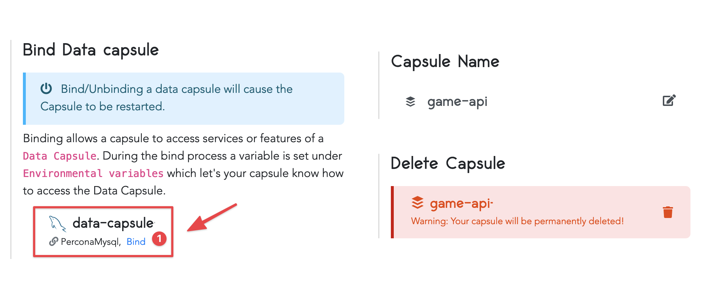
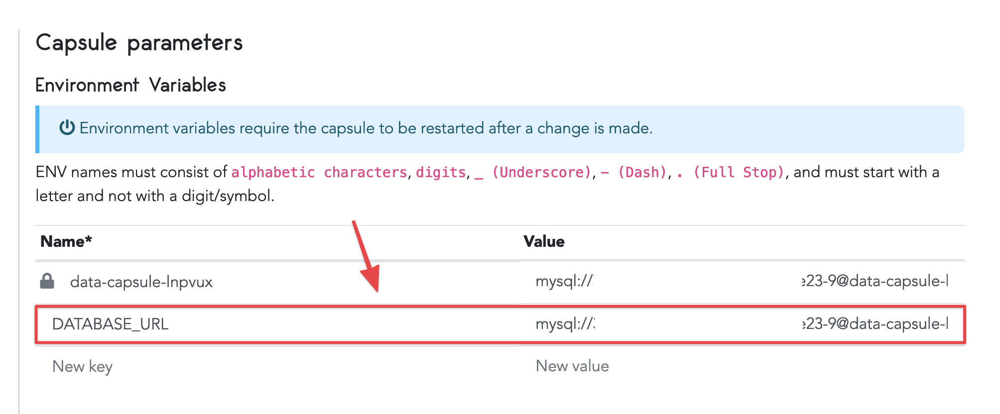
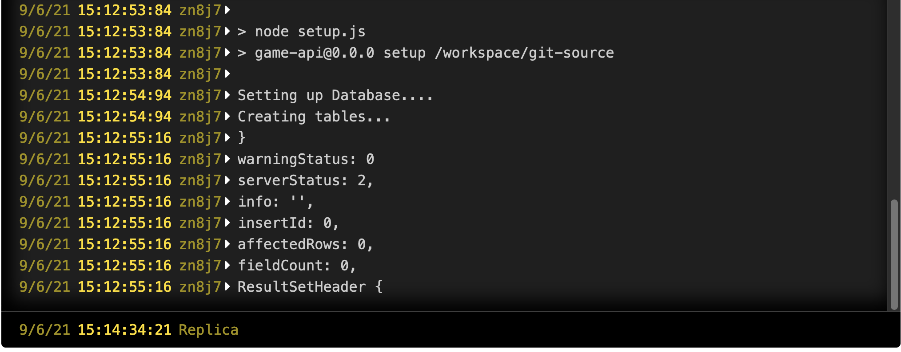
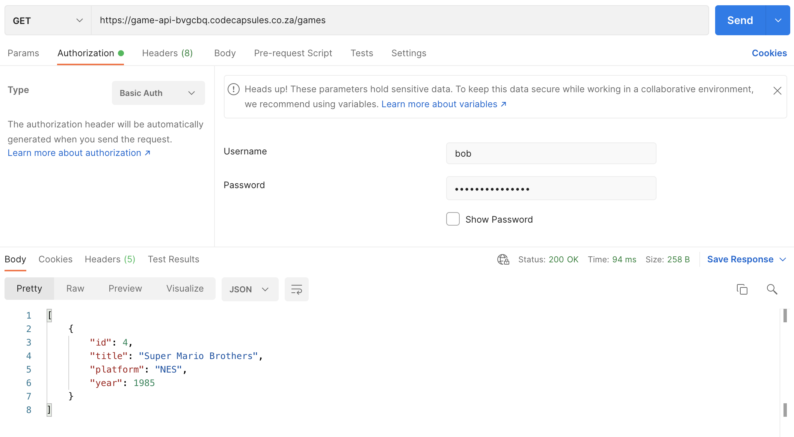

# Building a Game Catalogue API 

APIs are a common way to expose data and information on the internet. Many web services and apps run off of multiple APIs in the background. Because APIs are so ubiquitous, it is very useful to learn the basics of how to build one. 

In this tutorial, we'll build a simple [HTTP REST API](https://www.restapitutorial.com) to provide Create, Read, Update and Delete (CRUD for short) functions for a personal game catalogue. We'll secure it with [HTTP Basic authentication](https://developer.mozilla.org/en-US/docs/Web/HTTP/Authentication), while allowing for an easy upgrade to a more secure scheme. 

We'll use [MySQL](https://www.mysql.com) as the data store, [Node.js](https://nodejs.org/en/) as the application language, and Code Capsules to host all the components.

## Overview and Requirements

You'll need the following services and software set up for this tutorial: 

- [Git](https://git-scm.com) setup and installed, and a registered [GitHub account](https://github.com).
- [Node.js](https://nodejs.org/) installed.
- A registered [Code Capsules](https://codecapsules.io) account.
- An IDE or text editor to create the project in. This tutorial was made using [Visual Studio Code](https://code.visualstudio.com), but you can use any tool you like. 

## Setting up the Project

With our requirements in place, we can get started setting them up to work as needed for our web file project.

### Creating a New Repo 

We need a place to store our code from which [Code Capsules](https://codecapsules.io) can deploy to a Capsule.

Head over to [GitHub](https://github.com) and create a new repo. We're calling it _game-api_ here, but you can give it any name. Choose a **Node** `.gitignore` file to get started. Then clone the new Github repo onto your computer and navigate to that directory in terminal (or command prompt, if you're on Windows).

### Initialising the Base Project

We'll use the [Express](http://expressjs.com/en/starter/generator.html) generator to create the project base. [Express](http://expressjs.com) is a lightweight web framework for Node.js. To create the base project, type in the following: 

```bash
npx express-generator --no-view
npm install
```

This creates a few files and folders that we can edit. The `--no-view` option tells the generator to skip adding an HTML view engine. This is because we don't need any views for an API. 

The command `npm install` downloads and installs all the dependencies and packages required by the base project. Open the folder with [Visual Studio Code](https://code.visualstudio.com) or an editor of your choice, and browse through the files to get familiar with them. The `app.js` file in the project root is the main entry point for the app. 

Great, it's time to push this boilerplate project up to Git. We can do it with the following from the command prompt or terminal: 

```bash
git add . 
git commit -am 'added base files for project'
git push origin
```

### Creating a New Backend Capsule 

We'll need a place to host our app. 

1. Log in to [Code Capsules](https://codecapsules.io), and create a Team and Space as necessary.
2. Link [Code Capsules](https://codecapsules.io) to the [GitHub account](https://github.com) repository you created above. You can do this by clicking your user name at the top right, and choosing _Edit Profile_. Now you can click the _Github_ button to link to a repo. 
3. Create a new Capsule, selecting the "Backend" capsule type.
4. Select the GitHub repository. If you are only using the repo for this project, you can leave the _Repo Subpath_ field empty. You may need to add your repo to the team repo if you haven't already. Click the _Modify Team Repos_ to do so. 
5. Click _Next_, then on the following page, click _Create Capsule_. 

### Creating a New Data Capsule 

We'll need some data storage to store the files that are uploaded to the web drive. 

1. Create a new Capsule, selecting the "Data Capsule" type. 
1. Select "MySQL" as the Data Type. Choose a product size, and give it a name. 
1. Click "Create Capsule". 
1. You can follow the [in-depth creation guide](https://codecapsules.io/docs/reference/set-up-mysql-data-capsule/) if you'd like more information on creating a Data Capsule. 


### Link the Capsules

To use the Data Capsule with the Backend Capsule, we need to link them. Head over to the Backend Capsule you created above, and click on the "Config" tab. Then scroll down to "Bind Data Capsule", and click "Bind" under the name of the data capsule you created. 



After binding the Capsules, scroll up to the section "Capsule Parameters". You'll notice that an environment variable, `DATABASE_URL`, is automatically added containing the connection string to the MySQL database. We'll use this environment variable in the code to access the MySQL database. 



## Writing the API Code

Now that we have all our systems set up, we can get onto coding part. 

### Creating the Database Tables

We need to set up our database with a table to store the list of all our games. We'll create a very simple table with the following columns:

| id | title | system | year |
|----|-------|--------|------|
|    |       |        |      |

We don't have direct access to the Data Capsule and the MySQL database it's running. We can only access the Data Capsule from our Backend Capsule. So, to make a new table, we'll create a setup script which we can direct the Backend Capsule to run. 

Create a new file called `setup.js` in the root of your project. Now we need to install a package that will allow us connect to MySQL and send commands. We'll use [MySQL2](https://www.npmjs.com/package/mysql2). Use `npm` from the terminal to install this package:

```bash
npm install mysql2
```

Now we can add the code to create the table. In the new `setup.js` file, add the following code: 

```js
const mysql = require('mysql2');

console.log('Setting up Database....');

const connection = mysql.createConnection(process.env.DATABASE_URL);

console.log('Creating tables...');
connection.execute(`
    create table games
      (
        id int auto_increment,
        title varchar(500) not null,
        platform varchar(500) not null,
        year int not null,
        constraint games_pk
          primary key (id)
      );
    `, 
    function(err, results, fields){
      if (err) {
        console.error(err);
      }
      console.log(results); 
}); 
```
This code imports the `mysql2` driver package. We write a boot message to the console, just so we can see when the code runs in the logs. Then we can create a new connection to the database, using the connection string that was automatically added to the `DATABASE_URL` environment variable when we bound the capsules. Then we use the `execute` function to send a SQL command to the database. The SQL command creates a new table with the columns defined above. It has a callback to let us know if the operation is a success or if it has an error. In both cases, we write the output to the console, so we'll be able to see what happened when we read the logs. 

Now, we need a way for the Backend Capsule to run this setup script. We can use the `package.json` file to register a new command that `npm` will be able to run. Open the `package.json` file and add in the following line to the `scripts` object:

```js
    "setup": "node setup.js"
``` 

The complete `package.json` file should look like this now: 

```js
{
  "name": "game-api",
  "version": "0.0.0",
  "private": true,
  "scripts": {
    "start": "node ./bin/www",
    "setup": "node setup.js"
  },
  "dependencies": {
    "cookie-parser": "~1.4.4",
    "debug": "~2.6.9",
    "express": "~4.16.1",
    "morgan": "~1.9.1",
    "mysql2": "^2.3.0"
  }
}
```

We'll need to let our Backend Capsule know to run this script. Navigate to the "Configure" tab on the Backend Capsule, and scroll down to the "Run Command" section. Change this to:

```bash
npm run setup
```
Click "Update Capsule" to save this new setting. 

Let's commit the above code to the repo, and push it up so that Code Capsules can run it. Commit and push using the following commands in the terminal: 

```bash
git add . 
git commit -am 'added database setup script'
git push origin
```

If you navigate to the "Logs" tab on the Backend Capsule, you should see the script booting up and the result of the `CREATE TABLE` command. 



Once this is done, you can change the "Run Command" under the "Configure" tab back to:

```bash
npm start
```
Remember to click "Update Capsule" to save this. 

### Adding a Read Route

Our database is set up with a new table. Let's add some code to create an API route to read from this table. 

To keep the solution neater, we'll add a new file to contain the API route code. Add a new file called `games.js` in the `routes` folder in your project, with the following code:

```js
var express = require('express');
const mysql = require('mysql2');

var router = express.Router();

const connection = mysql.createConnection(process.env.DATABASE_URL);

router.get('/', function(req, res, next){
  
  connection.query(
    `SELECT * FROM games`,
    queryResults
  ); 

  function queryResults(err, results, fields){
    if (err) return next(err); 
    return res.json(results); 
  }
});
```
This code imports the Express module so that we can construct a `router`, and the `mysql2` module so that we can connect to the database. 

We create a (`router`)[http://expressjs.com/en/5x/api.html#router], which is an object that allows us to group routes and middelware together logically. We'll add all our CRUD routes to this router object. Then we create a new database connection, as we did in our setup script. 

Express routers allow us to add routes using the following structure:

```js
router.METHOD(PATH, HANDLER)
```  

`METHOD` is one of the standard [HTTP request methods](https://developer.mozilla.org/en-US/docs/Web/HTTP/Methods) to use. `PATH` is the relative part of the server URL to get to the route, and `HANDLER` is a function that we want run when the route is accessed. 

To create the read route, we use the HTTP `GET` verb, which can be configured using the `get` method on the router. Since we need no parameters, we set the path to `/`. Then we add our handler function. The function accepts 3 arguments from the Express router: 

- `req`, which is all the incoming request parameters and context from the client.
- `res`, a results object where we can specify how to return data to the client.
- `next`, a function that we can call to hand control to the next middleware in our route, if there is any. If we want to signal an error, we can pass an argument to `next`, and Express will return an error to the client with the data in that argument. 

In our `get` handler, we run send a SQL query to the database to select all entries from the database. The `query` method takes a SQL query and a callback function. This callback is called with the results or error from the SQL server. We use a separate named function as our callback. This is mainly a stylistic choice - we could write the function inline, but our code would be less readable, as it would have many indentations and creep to the right-hand side of the screen. 

In the callback, we check if the `err`, or error, paramater is set. If it is, we use the `next` function along with the error to exit the route early. This will send an error message to the client. 

If there is no error, we send the results of the SQL query back, formatted as [JSON](https://en.wikipedia.org/wiki/JSON). 

Now that we have the router set up and our first route created, we can hook them up to the main Express app. Open the `app.js` file in the route folder and add the following code above the line `var app = express();`:

```js
var gamesRouter = require('./routes/games');
```

This adds a reference to the router we defined in the `game.js` file. 

Now, let's use this reference to add the router to the Express app. Add the following line just above the `module.exports = app;`: 

```js
app.use('/games', [ gamesRouter ]); 
```

This mounts the route at the path `/games` on our server. 

Let's test all of this by committing and pushing these changes:

```bash
git add . 
git commit -am 'added get route for games'
git push origin
```

If you visit the Code Capsules dashboard for the Backend Capsule, you should see a note that it's building. Once it's finished building, head over to your site in a browser and navigate to the `/games` route. You should see it return an empty array:


This works, but is not very interesting! Let's add a create route so that we can add new game entries. 

### Adding a Create Route

We'll use the [HTTP POST](https://developer.mozilla.org/en-US/docs/Web/HTTP/Methods) method as the verb for creating a new game in the catalogue. 

For the create route, it would be nice to return the newly created entry, along with the id automatically created by MySQL for the entry. To do this, we'll first need to `INSERT` the new data into the database, and then run a `SELECT` command to retrieve the fully created database object. We can use the concept of ["middleware"](http://expressjs.com/en/guide/routing.html) in Express to achieve this. 

Each route allows us to chain multiple handlers to it, with each handler running one after the other. This is the core concept of middleware. So to implement our create route with its two distinct operations, we can chain 2 handlers, like this: 

```js

router.post('/', [functionOne, functionTwo])

```` 

Here, `functionOne` can pass control to `functionTwo` by calling the `next()` parameter, which is passed into each handler by Express. We can also pass custom information from one handler to another by adding it onto the `req` object, which is also passed to each handler by Express.

Ok, enough theory, let's add this code using what we know from above:

```js
router.post('/', [addNewGame, returnGameById]);  


function addNewGame(req, res, next){
  connection.query(
    `INSERT INTO games
      (title, platform, year)
      VALUES (?, ?, ?)`, 
      [req.body.title, req.body.platform, req.body.year],
    queryResults
  );

  function queryResults(err, results, fields){
    if (err) return next(err); 
    req.body.id = results.insertId
    return next(); 
  }
}

function returnGameById(req, res, done){
  connection.query(`
    SELECT * FROM games
    WHERE id = ?
    `,
    [req.body.id],
    queryResults
  ); 

  function queryResults(err, results, fields){
    if (err) return next(err); 
    return res.json(results); 
  }
}

```

We've implemented each of the handlers as separate, named functions. You could implement both as inline functions, but again, it's a stylistic choice to improve readability. Also, by writing each handler as a named function, the list of the functions passed to the router is almost self-documenting, telling us the steps the route takes. Lastly, we can also re-use each of the handlers in other routes if we need to. 

The first handler, `addNewGame`, uses a SQL `INSERT` query to create a new database row. Note the `?` placeholders in the query. This feature of the [MySQL2](https://www.npmjs.com/package/mysql2) package allows us to pass in arguments to the query, instead of concating the query with our incoming values. The values passed in from the client can be found on the `req.body` object, neatly parsed into JSON by Express. We can pass these values in an array as an argument to the query function. The function will substitute each `?` for a value, in order that are passed in the array. We use a function `queryResults` as we did for the `get` route, as our callback. Note here that the `results` parameter on this occasion will have an object of stats and information on the `INSERT` operation. One of the fields is `insertId`, which is the automatically assigned `id` of the new record in the database. We add this to the `req.body` object, and then call `next()` to pass control to the next handler, `returnGameById`. 

The handler `returnGameById` queries the database for the newly created object, using the `id` field we added to the `req.body` object in the first handler. In the callback for the query, `queryResults`, we return the database row as a JSON object, using the [`res.json`](http://expressjs.com/en/5x/api.html#res.json) method. 

To test this, commit and push the code up again to Code Capsules.

```bash
git add . 
git commit -am 'added post route for games'
git push origin
```

Once it has successfully built and deployed on Code Capsules, we can try this new route out. To do this, download [Postman](https://www.postman.com), which is a tool that makes it easier to interact with APIs. 

Create a new query in Postman, with the HTTP method set to "POST". Set the URL to the URL of your Backend Capsule, along with the `/games` path. Then click the "Body" tab, select "raw" as the mime type, and select "JSON" from the dropdown as the content type. 

Add the following JSON payload to the body:

```js
{
    "title" : "Super Mario Brothers", 
    "platform" : "NES",
    "year" : 1985
}
```

Click "Send", and your API should send back the newly inserted game, along with its `id`:


### Adding an Update Route

Now that we can add a game, and read back the catalogue, we might need to update an entry if we find an entry has a mistake. This is usually expressed as the [HTTP PUT method](https://developer.mozilla.org/en-US/docs/Web/HTTP/Methods). As a convention, the `id` of the document to update is passed in the URL path, and the updated document values are sent in the body. 

We'll use the same pattern as we did for the `post` route, and re-use the `returnGameById` function to retrieve the newly updated row from the database. 

Add this code to add the update route: 

```js
router.put('/:id', [updateGame, returnGameById]);

function updateGame(req, res, next){
  connection.query(
    `UPDATE games
      SET title = ?, platform = ?, year = ?
      WHERE id = ?`, 
    [req.body.title, req.body.platform, req.body.year, req.params.id], 
    queryResults
  ); 

  function queryResults(err, results, fields){
    if (err) return next(err); 
    req.body.id = req.params.id
    return next(); 
  }
}
```

This code is very similar to the `post` route. The major difference being that we use the SQL `UPDATE` statement to update an existing row. Note that we get the `id` of the row to update from the `req.params` object. This object contains all the parameters passed and defined in the path. 

In the `queryResults` callback, we set the `req.body.id` field to the `id` from the `params`. This is so the `next()` handler can access the `id` of the updated record and retrieve the latest version from the database. 

Commit and push this code to deploy it to Code Capsules. Now you can test this route in Postman, by updating the HTTP method to `put`. Add the id `1` to the games path, and change some of the information in the body. Click "Send" and you should see the API return the update document. 


### Adding a Delete Route

The last route we need to add is a delete route to remove a game entry. Luckily, HTTP has a [`DELETE` method](https://developer.mozilla.org/en-US/docs/Web/HTTP/Methods) as part of its standard. 

The delete route will work similarly to our other routes. However, since we are removing a record, we don't need to return any data. We can just return the usual status code to signal everything worked OK. 

```js
router.delete('/:id', function(req, res, next){
  connection.query(
    `DELETE FROM games
      WHERE id = ?`, 
    [req.params.id],
    queryResults
  )

  function queryResults(err, results, fields){
    if (err) return next(err); 
    return res.sendStatus(200);  
  }
});
```

As in the update route, we expect the `id` of the record to delete to be provided by the client in the URL path. Then we run the SQL `DELETE` command, with the `id` from the path in `req.params.id` passed in to replace the single `?` placeholder. 

Because we don't have any record to return (we deleted it!), we just return a [status code `200`] (https://en.wikipedia.org/wiki/List_of_HTTP_status_codes#2xx_success), which means everything worked OK. 


Great, it's time to commit this code, push it up and test it. You should be able select the "DELETE" verb in Postman, and add in a game `id` to the route. Click "Send", and you should see a blank reply, with the status code as `200 OK`. 


### Adding Authentication

We've built a basic CRUD API, and we can do all the usual operations on it. However, anyone can access it. Let's add some authentication to take care of that issue. 

For this tutorial, we'll implement a very simple access control system, that only allows access to one pre-defined user. We'll use the [HTTP Basic authentication](https://developer.mozilla.org/en-US/docs/Web/HTTP/Authentication) scheme for this, implemented with the [Passport](http://www.passportjs.org/docs/basic-digest/) package. 

Let's start by installing the two packages required. The first is the base Passport package, and the second is a package with the HTTP Basic authentication strategy. 

```bash
npm install passport passport-http
```

Now we add this as middleware, to check credentials before our `games` routes are called. In the `app.js` file, add the following near the top of the file, just under the other package `require` statements: 

```js
const passport = require('passport');  
const BasicStrategy = require('passport-http').BasicStrategy; 
```

We'll need a place to store the user credentials, so we can check them against the credentials the client supplies. We can store them in the environment settings, as they'll be stored in plain text, i.e. unencrypted. In a production application, you would store them in the database, with the password hashed and salted. We'll leave that option as something for you to explore :). 

Head over to the "Config" page on your Backend Capsule, and add 2 new environment variables : `USERNAME` and `PASSWORD`. Supply values of your own to set your username and password, and click `Update Capsule` when you are done.  


Now we can add the Passport code to check incoming credentials against these stored credentials. Add this code just above the `var gamesRouter = require('./routes/games');` line in `app.js`:

```js
passport.use(new BasicStrategy(
  function(username, password, done) {
    if (username === process.env.USERNAME && password === process.env.PASSWORD){
      return done(null, {username: process.env.USERNAME }); 
    }
    else {
      return done(null, false); 
    }
  })
);
```

This sets up Passport to use the "basic" strategy for authentication. We supply a callback function which checks the incoming credentials against the credentials in the environment variables. If they match, we call the Passport `done()` function, with the a simple user object containing the user name. If there is no match, we call the `done()` function with `false` to signal that we found no match for the user. 

The final part is to add the Passport authenticate middleware to the routes we want to protect. We'll add it to all our game routes. 

Update the line: 
```js
app.use('/games', [gamesRouter]); 
```

to: 

```js
app.use('/games', [passport.authenticate('basic', {session: false}), gamesRouter]); 
```

We set the `session` flag to false, as the convention for APIs is to require credentials to be passed with every request, i.e. no session cookies are used. 

Commit and push this updated code to deploy it. Once it is running, if you try any of the routes in Postman, you should see an authentication error message. 


To send the credentials along with your request, select the "Auth" tab in Postman. Choose "Basic Auth" from the dropdown list, and enter the credentials you set in the right-hand pane.


If you try your query again, it should let you pass, and come back with the usual response. 



## Next Steps

Now that you've built an HTTP REST CRUD API, here are a couple more things to try: 

- Add more routes. For example, you could add a review for each game.
- Try different authentication schemes. There are a lot on Passport to choose from. It could be interesting to implement an OAuth 2.0 scheme, as these are often used in production. 
- Try adding validation to the routes, to ensure that the incoming data is in the correct format and has all the necessary fields. 


